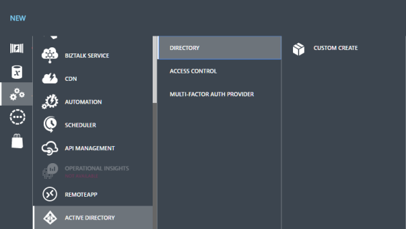
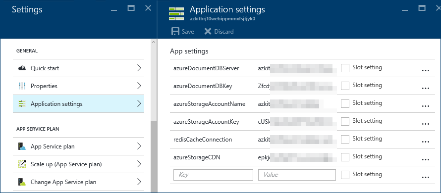
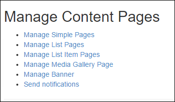

# azure-solutions-digital-marketing-reference-implementation
Reference implmentation for the Azure Digital Marketing Solution. This example provides an initial framework for the development of a multi-channel digital marketing solution that is customizable and extensible.
## Requirements
-   Active Azure Subscription

-   Visual Studio 2015 Update 3 with Xamarin Tools

-   Azure SDK and Tools 2.9 for Visual Studio 2015

## Running this web app locally
1.  Clone the repo

1.  Open the **AzureKit - Server Only** solution file in Visual Studio 2015.

1.  Perform a Build to restore NuGet packages.

1.  Press F5.

1.  Accept the request to enable SSL.

1.  You should see the site home page.

## Deploy the web app to Azure
In order to deploy to Azure using the included ARM template, you will need an ARM accessible storage account. In addition, you’ll want to create a custom Azure AD tenant specifically for this app.

1.  In the **AzureKit.Deployment** project, expand the **Templates** folder.

1.  Open **AzureKit.Developer.parameters.json**.

1.  Change the **UniqueNamePrefix** **value** to something other than **azKit**.

1.  Save your change.

1.  Right click **AzureKit.Deployment** and select **Deploy | New Deployment**.

1.  In the **Deploy Resource Group**, log in with your Azure credentials.

1.  Select your desired **Subscription**.

1.  In the **Resource group** combo-box, choose the **Create New** option, or select an existing one.

1.  From the **Deployment template** combo-box, select the **azurekit.developer.json** item.

1. In the **Deployment** template combo-box, select the **azureKit.developer.parameters.json item**.

1. For the **Artifact storage account**, select your desired storage account.

1. When ready, click **Deploy** to start the process. Monitor progress in the Visual Studio Output window. Once the deployment is done you can see the new objects created by accessing portal.azure.com and examine your **Resource Group**.

1. Next you need to deploy the web site. Right click on the **AzureKit** project and select **Publish**.

1. In the **Publish** dialog, select **Microsoft Azure App Service** for the **publish target**.

1. In the **App Service** dialog, select the **Azure Subscription** you used with your ARM template and then the **Resource Group**.

1. Finally expand your Resource Group in the list of available items and select the App Service that matches the **UniqueNamePrefix** you defined earlier.

1. Click **OK** when ready.

1. Back in the **Publish** dialog, click **Next** on the **Connection** page.

1. On the **Settings** page ***remove*** the check next to **Enable Organizational Authentication**. You will do this later in the Azure Portal.

1. Click **Next**.

1. Finally on the **Preview** page, click **Publish**. Once Visual Studio finishes the web deploy, it will open your default web browser to your site’s home page.

### Configure Azure Active Directory

1. Access the legacy Azure Portal at <http://manage.windowsazure.com> to configure Azure Active Directory (Azure AD) for your application.

   > This is the old Azure management portal which you still need to use in order to manage some resources that have note moved to the new Azure Portal.

1.  Scroll down in the left navigation pane and select the Active Directory option.

      

1.  Click the + NEW button at bottom.

     

1.  Select **APP SERVICES | ACTIVE DIRECTORY | DIRECTORY | CUSTOM CREATE**.

     

1.  Provide a **Name** for your directory.

1.  Provide a unique **Domain Name**.

1.  Select the appropriate **Country or Region**.

1.  ***Do not*** check **This is a B2C directory**.

     

1.  Click the **Check Mark**.

1.  Select your new directory.

1.  Click the **Domains** tab to view the domains associated with your directory.

     

1.  You will see one default domain associated with the directory. Make note of this directory name as you will need it later for the web.config value **ida:Domain**.

     

1.  Click on the **Applications** tab.

1.  Click the **Add** button in the bottom toolbar area to start the process of creating a new application.

     

1.  When prompted, choose to **Add an application my organization is developing**.

     

1.  Enter a **Name** for your application and leave the default selection for a **Web Application / Or Web API** selected.

     

1.  Then click the right arrow button to move to the next step.

1.  For the **Sign-on URL** enter [**https://localhost:44300/**](https://localhost:44300/).

    > **Note** This is the address your application will be using when developing locally. When you deploy to Azure you can change this value in the portal or setup a separate application for the instance when it runs in Azure (recommended).

1.  Enter a unique URI in the **App ID Uri** field for the application such as you company domain name and the application name. This is a unique logical identifier for your app.

     

    > **Note** Because the App ID URI is a logical identifier, it does not need to resolve to an Internet address.

1.  Click the check mark button to complete the application setup.

1.  Once Azure has created the application, select the **Configure** tab and scroll down to find the **Client ID**.

     

1.  Copy the Client ID value using the button next to the field and save it somewhere You will use this as the value for the **ida:ClientId** in web.config.

1.  Scroll down the page. In the Single sign-on section, you’re going to add a Reply URL.

1.  Open a new browser tab if necessary and navigate to <http://portal.azure.com> and location your Resource Group.

1.  In the Resource Group, find your web app’s App Service and select it.

     

1.  In the Web App Essentials section, copy the URL.

1.  Return to your browser window where you’re editing the Azure AD settings and add the URL you just copied as a Reply URL but change the protocol from HTTP to HTTPS.

1.  Click the **Save** button at the bottom.

     

1.  Click the bottom toolbar button labeled **View Endpoints**.

     

1.  Copy the tenant ID from any of the URLs provided. The tenant ID will be the GUID/Unique identifier immediately following the login domain. This will be used for the **ida:TenantId** in web.config.

    > **Note** You may need to use the copy button to copy the entire URL, then paste into a text editor to selectively copy out just the tenant ID.

1.  Close the **App Endpoints** dialog. Now you will configure users.

1.  In the management portal, click the “back” arrow to return to the directory tenant page.

     

1.  Click the **Users** tab to view users for the tenant.

    > **Note** Make sure you are not on the tab of the same name for the application as that is for specific assignment of users to allow them access to the application.

     

1.  Take note of the existing user. It will be the account you’re using to manage the directory. If you plan to test with this users, you can move on to finish configuring the application in Visual Studio.

1.  Click the **Add User** button in the bottom toolbar to add a new user.

1.  You can choose to add a new user (that will be covered here) or add other users with existing Microsoft Accounts or from other Azure Active Directory instances, and even partner organizations. For this example, choose **new user in your organization**.

1.  Enter a user name unique to this directory and move to the next dialog in the wizard.

1.  Enter values for the names and select **User** for this example.

    > **Note** You are creating a user in this directory. If this is your company directory or a production directory, be careful who you add as you may be giving them rights to your organization, applications, or data.

1.  Make sure to only choose **User** for the role as this is the role in the organization, not your application.

1.  Move to the next dialog in the wizard and click the button to get the temporary password.

    > **IMPORTANT** Copy this value as it will not be presented again and you will need it to login to the application. You will have to change the password on first login. Note that you can change the password at a later time from the management portal if you forget it.

1.  Complete the wizard.

### Configure Debug Configuration Settings for Visual Studio 2015

1.  Back in Visual Studio 2015, create a new Text File and save it as **developerSettings.config** in the same folder as the web site's **web.config** file. 

1.  From the **web.config** file copy the **appSettings** section into the **developerSettings.config** file.

1.  Update the values in the **appSettings** section of the **developerSettings.config** using values from your notes and the values saved by the ARM script in the Web app's Application Settings.

    

1.  The values you should be updating are:

    - ida:ClientId
    - ida:TenantId
    - ida:Domain
    - azureStorageAccountName
    - azureStorageAccountKey
    - azureDocumentDBServer
    - azureDocumentDBKey
    - azureStorageCDN
    - redisCacheConnection

1.  Save the file. 

### Debug Mobile Apps in Visual Studio 2015
The sample includes three mobile apps built with Xamarin forms (Android, iOS, and UWP). All three share a common PCL.

Each app has a settings page you can use to specify your web app's URL. 

To save typing in the emulators / test devices, you can acces the **AZKitMobile (Portable)** project in Visual Studio 2015, edit **Constants.cs** and set the **DEFAULT_URL_MOBILE_SERVICE** to the URL for your web app.

> **Note** When you first run the mobile apps, they will try and register for push notifications. You can ignore if you just want to see the apps load content from your site.

### Configure Notifications
To enable push notifications, you'll need to follow the instructions for **Add push notifications to your Xamarin.Forms app** at [**https://azure.microsoft.com/en-us/documentation/articles/app-service-mobile-xamarin-forms-get-started-push/**](https://azure.microsoft.com/en-us/documentation/articles/app-service-mobile-xamarin-forms-get-started-push/).

> **Note** The core code for working with notifications is written. You just need to configure Azure and update the web app and mobile apps with the correct connection strings.

You need to Create a Notification Hub, then for each plaform you want to support, sign up for notifications with Apple, Google, and Microsoft respectivly.

Once you have your hub created, you'll need to add the connection string to your web app's settings and/or web.config.

### Enable Login for Mobile Apps
The mobile apps support sign in via Azure AD. The web app currently doesn't restrict content but this example provides you with a framework for restircting content for authenticated users.

1.  Access your web app in the Azure portal.

1.  In **Settings**, select **Authentication / Authorization**.

     

1.  At the **Authentication / Authorization** blade, turn **ON** **App Service Authentication**.

1.  Change the **Action to take when request is not authenticated** to **Allow request (no action)**.

     

1.  Under **Authentication Providers**, select **Azure Active Directory**.

1.  Change **Management Mode** to **Advanced**.

1.  In the **Client ID** put your app's Client ID.

1.  In **Issue URL** add your **Tenant ID** to the end of the following URL: https://sts.windows.net/
     For example: https://sts.windows.net/9c1ff4a4-218f-46e3-a6f2-0f4a2a866388

     

1.  Click **OK**.

1.  Back on the **Authentication / Authorization blade**, click **Save**.

## About the code
The sample application provides code built on top of the stanard ASP.NET MVC Teamplate to host and web app in Azure App Service that uses DocumentDB, CDN, ReDis Cache and Azure AD.

Once you have the web app deployed and Azure AD Configured, you can click **Sign in** and use your Azure AD configured creds to sign in to the site.

Once in, you can click **Manage** to access the content management features.

You can manage an array of different content pages.

**Manage Simple Pages**: create / edit / delete single pages of information

**Manage List Pages**: create / edit / delete list header pages

**Manage List Item Pages**: create / edit / delete list detail pages

**Manage Media Gallery Page**: create / edit / delete media gallery pages and manage content

**Manage Banner**: allows you to specify a  message shown on home page in the jumbotron up to a certain date and time

**Send notifications**: if push notifications are configured, allows  you to send messages to registered users

Simple pages and list Item pages can be enabled for viewing on the mobile apps.

The content editing pages use the  [**WYMeditor**](https://github.com/wymeditor/wymeditor/). Please see the [**license**](https://github.com/wymeditor/wymeditor/blob/master/GPL-license.txt).

## More information
Visit [**https://azure.microsoft.com/en-us/documentation/**](https://azure.microsoft.com/en-us/documentation/) for more information. 
