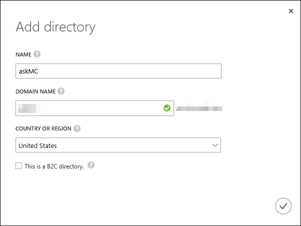

# Deploy from Visual Studio 2015
Follows these instructions if you want to build and deploy to Azure from Visual Studio 2015.

## Requirements
-   Active Azure Subscription

-   Visual Studio 2015 Update 3 with Xamarin Tools

-   Azure SDK and Tools 2.9 for Visual Studio 2015

## Running this web app locally
By running the app locally, you can ensure you have all the correct bits installed for later work and debugging. Note that full access to the management site will not be possible until you configure Azure Active Directory integration.

1.  Clone this repo.

1.  Open the **AzureKit - Server Only** solution file in Visual Studio 2015.

1.  Perform a **Build | Rebuild Solution** to restore NuGet packages and compile all the projects.

1.	Ensure **AzureKit** is your start-up project.

1.  Press **F5**.

1.  If prompted, accept the request to enable SSL.

1.  You should see the site home page.

      

### Configure Azure Active Directory

1. Access the legacy Azure Portal at <http://manage.windowsazure.com> to configure Azure Active Directory (Azure AD) for your application.

   > This is the old Azure management portal which you still need to use in order to manage some resources that have not moved completely to the new Azure Portal.

1.  Scroll down in the left navigation pane and select the Active Directory option.

      

1.  Click the + NEW button at bottom.

     

1.  Select **APP SERVICES | ACTIVE DIRECTORY | DIRECTORY | CUSTOM CREATE**.

     

1.  Provide a **Name** for your directory.

1.  Provide a unique **Domain Name**.

1.  Select the appropriate **Country or Region**.

1.  ***Do not*** check **This is a B2C directory**.

     

1.  Click the **Check Mark**.

1.  Once created, you can continue to the next section and close your browser window.

## Deploy the web app to Azure
Once you've created your directory, you use the ARM template to create all of your Azure resources. Once that is complete, you will deploy each of three apps.

1.  In the **AzureKit.Deployment** project, expand the **Templates** folder.

1.  Open **AzureKit.parameters.json**.

1.  Change the **NamePrefix** **value** to something other than **changevalue**.

1.  Save your change.

1.  Right click **AzureKit.Deployment** and select **Deploy | New**.

1.  In the **Deploy Resource Group**, log in with your Azure credentials if necessary.

1.  Select your desired **Subscription**.

1.  In the **Resource group** combo-box, choose the **Create New** option, or select an existing one. If you choose **Create New**, provide a valid name and select a location.

1.  From the **Deployment template** combo-box, select the **azurekit.json** item.

1.	In the **Deployment** template combo-box, select the **azureKit.parameters.json** item.

1.	Click the **Edit Parameters** button.

1.	Verify the **NamePrefix** is using a value you want.

1.	Set the **AppPlanSKU** to **Standard**.

1.	Set the **SqlAdministratorLoginPassword** to good strong password.

1.	Verify the **AppInsightsLocation** is where you want (not App Insights location can be different from your Resource Group choice).

1.	Click **Save** when ready.

1.	When ready, click **OK** to start the deployment process. You will be prompted to provide the password for the SQL Administrator. Do that when prompted. The, monitor progress in the Visual Studio Output window. 

	> Once the deployment is done you can see the new objects created by accessing portal.azure.com and examine your **Resource Group**. **Note** the deployment can take a while (in testing about 30 minutes). In addition, it is **possible** that your deployment could fail due with an error **"[ERROR] New-AzureRmResourceGroupDeployment : The access token expiry UTC time"**. If this occurs, just start the deployment over and it will complete.

1.	Next you need to deploy the web sites, one at a time. Right click on the **AzureKit** project and select **Publish**.

1.	In the **Publish** dialog, select **Microsoft Azure App Service** for the **publish target**.

1.	In the **App Service** dialog, select the **Azure Subscription** you used with your ARM template and then the **Resource Group**.

1.	Finally expand your **Resource Group** in the list of available items and select the App Service that matches the **UniqueNamePrefix** you defined earlier plus the word **website** followed by a zero. For *example* **askmcwebsite0**.

1.	Click **OK** when ready.

1.	Back in the **Publish** dialog, click **Next** on the **Connection** page.

1.	On the **Settings** page, click **Next**.

1.	Click **Next**.

1.	Finally on the **Preview** page, click **Publish**. Once Visual Studio finishes the web deploy, it will open your default web browser to your site’s home page.

1.	Next, right click on the **AzureKit.Api** project and select **Publish**.

1.	In the **Publish** dialog, select **Microsoft Azure App Service** for the **publish target**.

1.	In the **App Service** dialog, select the **Azure Subscription** you used with your ARM template and then the **Resource Group**.

1.	Finally expand your **Resource Group** in the list of available items and select the App Service that matches the **UniqueNamePrefix** you defined earlier plus the word **apisite** followed by a zero. For *example* **askmcapisite0**.

1.	Click **OK** when ready.

1.	Back in the **Publish** dialog, click **Next** on the **Connection** page.

1.	On the **Settings** page, click **Next**.

1.	Click **Next**.

1.	Finally on the **Preview** page, click **Publish**. Once Visual Studio finishes the web deploy, it will open your default web browser to your API site’s home page.

1.	Finally, back in Visual Studio, right click on the **AzureKit.Management** project and select **Publish**.

1.	In the **Publish** dialog, select **Microsoft Azure App Service** for the **publish target**.

1.	In the **App Service** dialog, select the **Azure Subscription** you used with your ARM template and then the **Resource Group**.

1.	Expand your **Resource Group** in the list of available items and select the App Service that matches the **UniqueNamePrefix** you defined earlier plus the word **managementsite**. For *example* **askmcmanagementsite**.

1.	Click **OK** when ready.

1.	Back in the **Publish** dialog, click **Next** on the **Connection** page.

1.	On the **Settings** page, select the Azure Active Directory domain you created earlier from the combo-box under the **Enable Organizational Authentication** option. For *example*, **askmc.yourdomain.com**.

1.	Click **Next**.

1.	Finally on the **Preview** page, click **Publish**. You will be prompted to login with the credentials for the user who is a Global Admin for the Azure Active Directory you specified earlier (this should be your account). Once Visual Studio finishes the web deploy, it will open your default web browser to your management site’s home page.

1.	From the management site's home page, you can log in and add content, etc. The first time you sign-in, you will see a permissions page. You must **accept** the request to use the management site.

      

## Configure Debug Configuration Settings for Visual Studio 2015 and Update Your App Settings in Azure
 
1.  Back in Visual Studio 2015, create a new Text File and save it as **developerSettings.config** in the same folder as the web site's **web.config** file. 
 
1.  From the **web.config** file copy the **appSettings** section into the **developerSettings.config** file.
 
1.  Update the values in the **appSettings** section of the **developerSettings.config** using values from your notes and the values saved by the ARM script in the Web app's Application Settings.
 
     
 
1.  The values you should be updating are:
 
     - ida:ClientId
     - ida:TenantId
     - ida:Domain
     - azureStorageAccountName
     - azureStorageAccountKey
     - azureDocumentDBServer
     - azureDocumentDBKey
     - azureStorageCDN
     - redisCacheConnection
 
1.  Save the file. 
 
## Using the App
The sample application provides code built on top of the standard ASP.NET MVC Template to host and web app in Azure App Service that uses DocumentDB, SQL Database, CDN, ReDis Cache and Azure AD.

Once you have the web app deployed and Azure AD Configured, you can click **Sign in** and use your Azure AD configured creds to sign in to the management site.

Once logged in, you can access the content management features.

You can manage an array of different content pages.

**Manage Simple Pages**: create / edit / delete single pages of information

**Manage List Pages**: create / edit / delete list header pages

**Manage List Item Pages**: create / edit / delete list detail pages

**Manage Media Gallery Page**: create / edit / delete media gallery pages and manage content

**Manage Banner**: allows you to specify a  message shown on home page in the jumbotron up to a certain date and time

**Send notifications**: if push notifications are configured, allows  you to send messages to registered users

Simple pages and list Item pages can be enabled for viewing on the mobile apps.

The content editing pages use the  [**WYMeditor**](https://github.com/wymeditor/wymeditor/). Please see the [**license**](https://github.com/wymeditor/wymeditor/blob/master/GPL-license.txt).

App icons from [**https://icons8.com/web-app**](icons8) and [**http://www.geekchamp.com/icon-explorer/introduction**](geekchamp).
