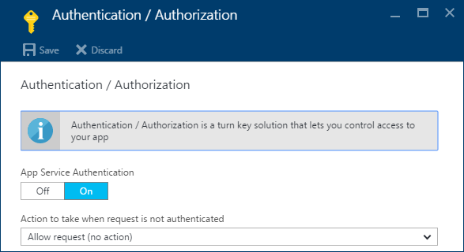
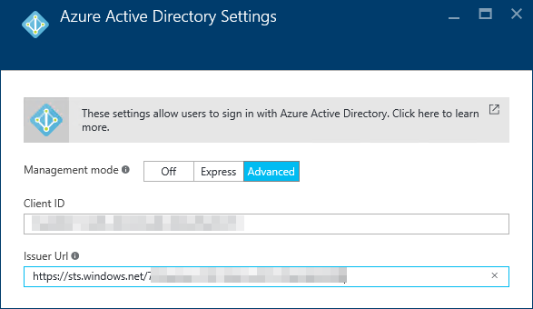

# Mobile Apps
The sample app includes mobile apps built using the Xamarin Tools.

## Requirements
-   Active Azure Subscription

-   Visual Studio 2015 Update 3 with Xamarin Tools

-   Azure SDK and Tools 2.9 for Visual Studio 2015

-	The web apps deployed to Azure

## Debug Mobile Apps in Visual Studio 2015
In order to work with these apps, the instructions assume you've either done the [Deploy from Visual Studio 2015](ReadMeVS2015.md) or the [Deploy from Visual Studio Team Services](ReadMeVsts.md) process and have the code downloaded locally and compiling.

The sample includes three mobile apps built with Xamarin forms (Android, iOS, and UWP). All three share a common PCL.

Each app has a settings page you can use to specify your web app's URL. 

To save typing in the emulators / test devices, you can acces the **AZKitMobile (Portable)** project in Visual Studio 2015, edit **Constants.cs** and set the **DEFAULT_URL_MOBILE_SERVICE** to the URL for your web app.

> **Note** When you first run the mobile apps, they will try and register for push notifications. You can ignore if you just want to see the apps load content from your site.

## Configure Notifications
To enable push notifications, you'll need to follow the instructions for **Add push notifications to your Xamarin.Forms app** at [**https://azure.microsoft.com/en-us/documentation/articles/app-service-mobile-xamarin-forms-get-started-push/**](https://azure.microsoft.com/en-us/documentation/articles/app-service-mobile-xamarin-forms-get-started-push/).

> **Note** The core code for working with notifications is written. You just need to configure Azure and update the web app and mobile apps with the correct connection strings.

You need to Create a Notification Hub, then for each plaform you want to support, sign up for notifications with Apple, Google, and Microsoft respectivly.

Once you have your hub created, you'll need to add the connection string to your web app's settings and/or web.config.

## Enable Login for Mobile Apps
The mobile apps support sign in via Azure AD. The web app currently doesn't restrict content but this example provides you with a framework for restircting content for authenticated users.

1.  Access your web app in the Azure portal.

1.  In **Settings**, select **Authentication / Authorization**.

     

1.  At the **Authentication / Authorization** blade, turn **ON** **App Service Authentication**.

1.  Change the **Action to take when request is not authenticated** to **Allow request (no action)**.

     

1.  Under **Authentication Providers**, select **Azure Active Directory**.

1.  Change **Management Mode** to **Advanced**.

1.  In the **Client ID** put your app's Client ID.

1.  In **Issue URL** add your **Tenant ID** to the end of the following URL: https://sts.windows.net/
     For example: https://sts.windows.net/9c1ff4a4-218f-46e3-a6f2-0f4a2a866388

     

1.  Click **OK**.

1.  Back on the **Authentication / Authorization blade**, click **Save**.
