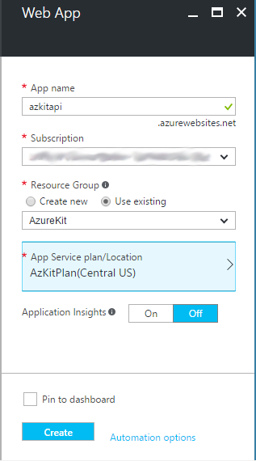

# Lab: Azure App Service

In this  lab, you will create three Azure App Services: one to host a
public-facing web site, one to host a web API to be consumed by mobile applications,
and one to host a management web site. Each of these three Azure App Service,
instances will all use the same App Service Plan, meaning they share the same
compute resources.

### Step 1: Create a Resource Group

Anything you create in Azure must belong to a Resource Group. You can group your
resources however you like - there's nothing stopping you putting every Azure
service you want to use in its own Resource Group. However, in general if your
subscription hosts multiple services, you would group related Azure resources
together. For example, if you have a web site that requires a Redis Cache instance,
you would typically put the Azure Web App that hosts the site in the same resource
group as the Redis Cache. Everything you create in Azure during these labs will
go into the same Resource Group.

You can delete all of the resources in a Resource Group in a single operation,
making it easy to clear thing up once you're finished with these labs. It is
also possible to deploy all of the Azure resources in a Resource Group in a
single step by defining a resource template, as you'll see if you complete
part 2 of this lab.

1. Open the Azure Portal ([https://portal.azure.com/](https://portal.azure.com/))
   in a web browser. Log in using an account that has access to  the Azure
   subscription you will be using.

2. On the left hand side, you will see various labelled icons. (It's possible to
   expand and collapse the labels by clicking the  icon,
   so you might see only the icons.) Near the top of this will be a
   **Resource groups** entry:

   

   Click it.

3. This opens the **Resource groups** 'blade'. (A blade is a panel in the Azure
   portal that serves some particular purpose such as managing a Resource Group
   or configuring a web site. As you will see, blades stack horizontally across
   the screen as you navigate through the portal.) Near the top you will see an
   **Add** button:

   

   Click this button.

4. The portal replaces the **Resource groups** blade with a **Resource group**
   blade in which you can enter the details for a new Resource Group:

   

   You must provide a name, which must be unique within your subscription.
   We suggest **AzureKit** but you can use any name.

   If you have access to multiple Azure subscriptions you will be required to
   choose the one in which you want to create this Resource Group. And you
   must also specify the geograph location to use. (This determines only the default
   location for new resources - a Resource Group can contain resources spread
   across multiple regions.)

   **Note:** not all Azure services are available in all regions. You can
   find a complete, up to date list of what is available where at
   [https://azure.microsoft.com/regions/services/](https://azure.microsoft.com/regions/services/)

5. Near the bottom of the blade, select the **Pin to dashboard** checkbox, then
   click the **Create** button.

   

6. You might briefly see the background of the Azure portal appear, with a message
   indicating that creation is in progress, but shortly afterwards, you will see
   a blade representing your new resource group, which will currently be empty.

   

7. Because you checked the checkbox asking to pin your Resource Group to your
   dashboard, it will always be easy to return to this blade after performing other
   tasks in the portal. Simply click the **Microsoft Azure** text at the top left of
   the portal, which will close any open blades and show the dashboard, and you
   will see a tile on the dashboard representing your Resource Group:

   

   **Note:** although tiles on the dashboard representing a Resource Group generally
   show the resources it contains, the tile does not always update immediately. So as
   you work through the labs, do not be surprised if you do not see a newly-created
   resource in this tile. If you click on the tile to open the Resource Group's blade,
   you will see an up to date list.

Now that you have created a Resource Group, you can create the resources required to
host the various web sites and APIs in the Azure Kit.

### Step 2: Create App for the Main Web Site

In this part, you will use Azure's App Service feature to host the kit's main web site.
(Azure App Service also has features designed to help with hosting web APIs, and
provides various services useful if you are writing back ends for mobile apps. And
it also offers *Logic Apps* which are workflow-based operations. We'll see some of
these features in laer labs; for now we're just using the basic web site hosting
capabilities.)

1. Near the top left of the Azure Portal, click the **+ New** entry:

   

   (If you have collapsed these items, you'll just see the **+** symbol.)

2. In the **Marketplace** list that appears, select **Web + Mobile**:

   

3. In the **Feature Apps** list that opens, select **Web App**:

   

4. The portal will show a **Web App** blade for entering details about
   your new app:

   

   You must enter a name, which needs to be globally unique - this name will form
   part of the hostname for your web site. (Azure will append `.azurewebsites.net`
   to whatever name you use, so you can't use a name that anyone else has already
   chosen for an Azure Web App.) By the way, this doesn't need to be the name users
   will see - you can configure a Web App to use any name in any DNS domain that you
   control, but the Web App will always also be accessible through the name you
   choose here.

   If you have multiple Azure subscriptions, you will need to choose the one you
   wish to use.

   Under **Resource Group** you should choose the one you created earlier.

   The **App Service plan/Location** determines the compute resources that will be
   used to host your site. Click on this, and it will show the following:

   

   If you already have one or more service plans in your subscription, they will
   appear here. But whether you do or don't we'll be creating a new plan, so click
   **Create New**. This blade will appear:

   

   In this blade you configure the new plan. The name in this case need only be
   unique within your Azure subscription. The location should be wherever you want
   to host the web app (the same as you chose for your Resource Group).
   
   The **Pricing tier** determines whether your plan will share compute resources with
   other Azure users, or will get its own dedicated CPU core(s) and memory. If
   you click this item, and then click **View all** to see all available tiers, you
   will see a wide price range. There is a *Free* option, which will be enough to get
   started, but performance won't be great. The *Shared* option also shares compute
   resource with others but provides additional functionality such as the ability to
   use a custom domain name. (Free web sites only get to use the `.azurewebsites.net`
   name.) The *Basic*, *Standard*, and *Premium* options all provide dedicated compute
   resources, each in either 1-, 2-, or 4-core configurations (and you can also
   scale out to multiple machines, to a maximum of 20 instances (80 cores if you
   choose the largest instance size) if you select *Premium*; *Standard* and *Basic*
   scale out to 10 and 3 instances respectively).

   **Note:** if you plan to do the Traffic Manager lab, in which you deploy web
   apps to multiple geographic regions, arranging for end users to communicate with
   whichever happens to be nearest, you will need to select either *Standard* or
   *Premium* because this feature is not available on *Basic*, *Shared* or *Free*.

   Once you've chosen a pricing tier, click the **Select** button. Then in the
   **New App Service Plan** blade, click **OK**. Finally, in the **Web App** blade,
   click **Create**. (You do not need to pin this item to the dashboard. You can
   if you want, but you'll be able to get to this Web App through the tile for
   your Resource Group which is already pinned to the dashboard.)

 5. The Azure portal will create your new Web App. You can watch its progress by
    clicking the bell icon near the top right of the browser window:

    

    The Azure portal shows messages here - you will see information about recently
    created items, such as your Resource Group. Once it has finished creating the
    Web App, the message will change to show that it succeeded:

    

    Your Web App now exists, but you haven't deployed anything to it, so if you were
    to look at it, you'd see only a placeholder page. So next, you will need to deploy
    the wep site.

### Step 3: Publish from Visual Studio.

1. Run Visual Studio 2015.

2. Select the **File | Open | Project/Solution** menu item (or type **Ctrl+Shift+O**).
   Find the `before` folder in the Azure Kit repository. Open the
   `AzureKit - Server Only.sln` solution file.

3. In **Solution Explorer** right-click on the **AzureKit** project. Select **Publish**
   The **Publish** dialog opens:

   

4. Select **Microsoft Azure App Service**. The **App Service** dialog opens:

   

   If you have access to multiple subscriptions, ensure that you have selected the one
   you are using. Also, select **Resource Group** under **View**. Visual Studio will
   search your Azure Subscription for App Services. This may take a few seconds, but
   you should eventually see your Resource Group, and if you expand it you should see
   your Web App. Select your Web App then click **OK**.

   The **Publish** dialog will now show its **Connection** page:

   

5. You do not need to change any of the default settings Visual Studio chose, so
   click **Publish**. Visual Studio will build the project and then deploy it to
   Azure. (This can take a few minutes the first time you do it.) Once deployment
   is complete, Visual Studio will show your site in a web browser.

   

   **Note:** although the main site is now deployed, it's not much use yet -
   it contains no content. To add content you'll also need to create the management
   site. We'll do that (and create the mobile API site too) in the next step, but
   even then there will be more work to do - you'll need to complete the Security and
   DocumentDB labs before the site will operate usefully.

### Step 4: Create and Publish Apps for the Mobile API and Management Site

The Azure Kit includes three web apps: the one you just deployed, one to host
an API for mobile apps, and one to host the management site. The management site
is used to set up content in the main site, so you won't be able to do anything until
you've deployed that. So let's create and deploy the other two apps.

1. Near the top left of the Azure Portal, click the **+ New** entry:

   

2. In the **Marketplace** list that appears, select **Web + Mobile**:

   

3. In the **Feature Apps** list that opens, select **Web App**:

   

4. As before, you will see a **Web App** blade for entering details about
   your new app:

   

   You will need to enter a different name for this, and to make it easy to see
   which web app is which, it would be a good idea to include the text `api` in
   the site name.

   As before, choose the subscription you're using if you have access to more than
   one, and choose the Resource Group you created earlier. This time, don't create
   a new App Service plan - just select the same one you created earlier.

5. Repeat the last 3 steps to create the management site, this time putting the text
   `management` somewhere in the web site name

6. In Visual Studio, right click the **AzureKit.Api** project in **Solution Explorer**
   and select **Publish**. As before, click **Microsoft Azure App Service**. This
   time you should see three Web Apps in the **App Service** dialog:

   

   Select the one you created to host the API and click OK. Visual Studio will
   deploy the web app to Azure, opening it in a browser once complete.

7. Finally, you need to deploy the management site, **which is slightly different**.
   Right-click on the **AzureKit.Management** project in **Solution Explorer** and
   select **Publish**. As before, click **Microsoft Azure App Service**, select the
   web app you created for your management site and click OK. But this time, when the
   **Publish** dialog shows its **Connections** page, click **Next**, to show the
   **Settings** page.

   

8. Notice how this page has an **Enable Organizational Authentication** checkbox.
   It will be checked by default. You need to uncheck it for now. (Later, in the
   Security lab, you will reenable it, but you will need to do some preparation
   first. So for now, you will need to leave it unchecked.)

9. Click **Publish**. Once the web site shows up in a browser, you are done.

**Note:** although you have now successfully deployed your sites to Azure, they're
not really useable yet. To be able to add content to the site, you will need to do
two more jobs. First, you will need to configure security on the management
application - you don't want just anyone being able to edit your site. Second, you
will need to configure somewhere to store the content. You will be doing these tasks
in the next two labs.