# Lab: Azure Functions

Azure Functions provide an event-based serverless compute experience to accelerate your development. It can scale based on demand and you pay only for the resources you consume.

## Part 1: Azure Functions On Its Own

In order to do this lab, you will need the following:

	An Azure Subscription
	A key for the Computer Vision API
	Any version of Visual Studio 2015
	Azure SDK for Visual Studio 2015
	Some images that you can resize

This lab part was inspired by Martin Kearn's blog post at [https://blogs.msdn.microsoft.com/martinkearn/2016/05/06/smart-image-re-sizing-with-azure-functions-and-cognitive-services/](https://blogs.msdn.microsoft.com/martinkearn/2016/05/06/smart-image-re-sizing-with-azure-functions-and-cognitive-services/ "Smart image re-sizing with Azure Functions and Cognitive Services"). Azure Function copied from the blog sample.

1. In your web Navigate to [ https://www.microsoft.com/cognitive-services/en-us/computer-vision-api]( https://www.microsoft.com/cognitive-services/en-us/computer-vision-api "Computer Vision API Page").

2.  Click the **Get started for free** button.

	  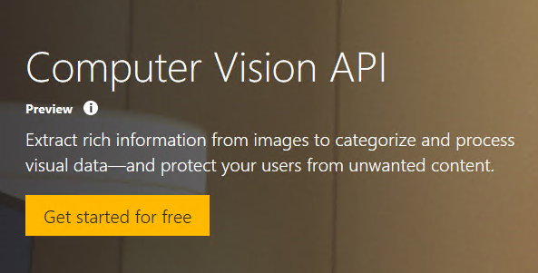

3.	Log in using one of the accounts listed, give Cognitive Services permission to access your account and verify your identity.

	  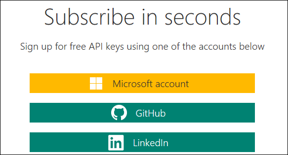

4.	Once you're verified, select a trial of the **Computer Vision - Preview**.

	  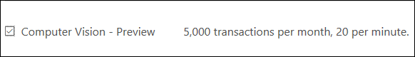

5.	Then scroll down to the bottom of the page and **agree** to the terms and *optionally* allow Microsoft to contact you.

	  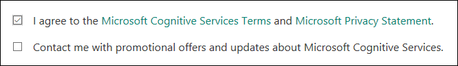

6.	Click **Subscribe**.

7.  On the next page, you'll see your subscription and two keys. Copy Key 1 and save it somewhere locally.
8.  In a fresh browser tab or window navigate to the Azure Portal.
9.	Select the **+ New** option.
10.	Next select **Compute**, then **Function App**. 
11.	Fill in the following items:

	- 	**App Name**: your choice
	- 	**Subscription**: pick a relevant subscription
	- 	**Resource Group**: create a new one
	- 	**Hosting Plan**: leave this as *Consumption Plan*
	- 	**Location**: pick a location that makes sense for you

12.	Next, select the **Storage Account** option.
13.	While you can use an existing storage account, it's best for this lab to just create a new, so select **Create New**.
13.	Provide a name for the **Storage Account** and then click **OK**.
14.	Verify your settings, and then click **Create**.

	  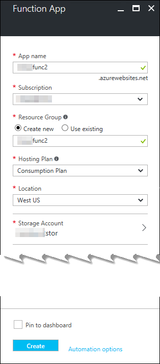
	
15.	Azure will display a message once it's done. If you click the message, you can see details of the deployment.

	  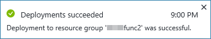

16.	Select the **Resource Group** icon on the left of the portal to get a list of resource groups.
17.	Find the Resource Group you specified for your Azure Function and select it.
18.	In the list of items, select your storage account.
19.	Once the blade opens, click the **Blobs** item.
20.	In the **Blob service** blade, select the **+ Container** command. You find one existing container called **azure-webjobs-hosts**.

		The Azure Functions runtime makes sure that no blob trigger function gets called more than once for the same new or updated blob. 
		It does so by maintaining blob receipts to determine if a given blob version has been processed. 
		Blob receipts are stored in the container named **azure-webjobs-hosts** in the Azure storage account for your function app.
 
21.	Set the **Name** to *uploaded*, leave **Access type** as *Private* and click **OK**.
22.	Repeat the process and create a second container called *processed*.
23.	Close the open blades and return the your resource group blade.
24.	In the list of items, select your function. Azure opens the Azure Functions Quickstart. You'll skip this and instead select +New Function from the left.

	  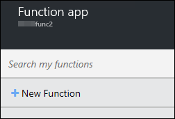

25.	In the list of templates that opens up, select **BlobTrigger-Charp**.
26.	In the lower part of the pane, enter *CreateThumbnails* in the **Name  your function** field.
27.	Change the **Path** to *uploaded/{blobname}.{blobextension}*.

		Curly braces are special characters in name patterns. 
		To specify blob names that have curly braces in the name, double the curly braces.
		In the version above, you're splitting up the name into parts for later use. You could use *{name}* if you didn't want the file name in pieces.

28.	Next to the **Storage account connection** combo-box, click the **new** link. In the blade that opens, select the correct storage account.

	  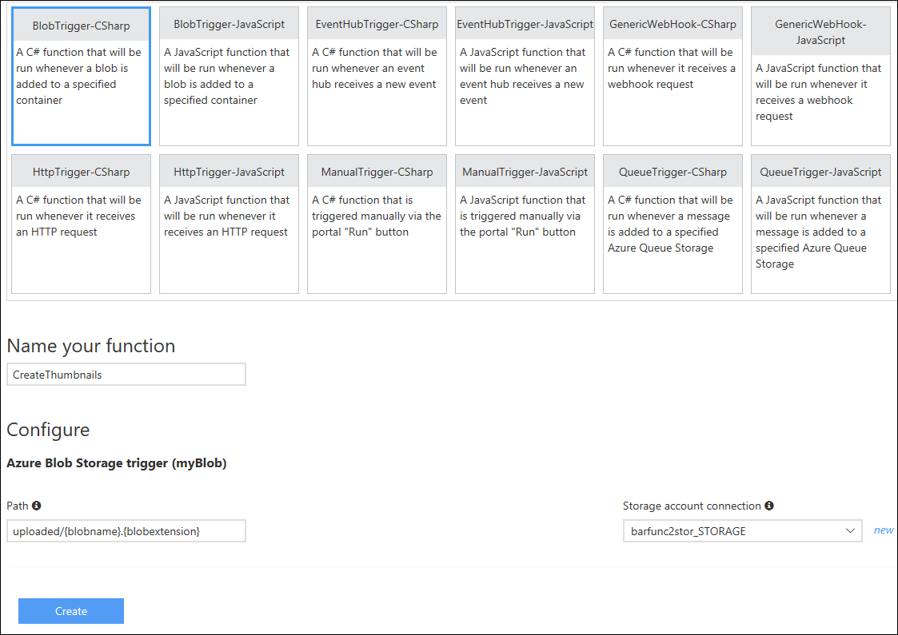

29.	Click **Create** when ready.

		You'll get an error. Don't worry. You can fix it.

30.	Close the error message.
31.	By default the starting code assumes you'll use the full blob name. In the C# code that appears, replace {name} with {blobname}.{blobextension}.
32.	Click **Save**.
33.	Click the **Integrate** tab.
34.	Under **Outputs** click **+ New Output**.
35.	Select **Azure Blob Storage** and then click the **Select** button.

	  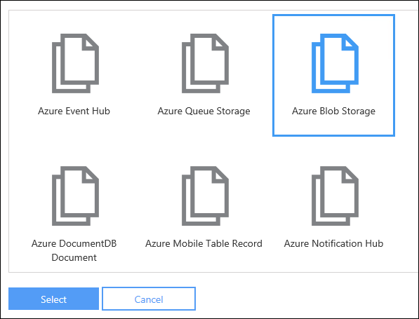

36.	Change the **Path** to *processed/{blobname}-thumb.{blobextension}*.
37.	In **Storage account connection** combo-box, select the correct storage account.
38.	Click the **Save** button.
39.	Click the **</>Develop** tab.
40.	Replace all of the existing code with the following:
		
		using System;
		using System.Text;
		using System.Net.Http;
		using System.Net.Http.Headers;
		
		public static void Run(Stream myBlob, Stream outputBlob, TraceWriter log)
		{
		    int width = 320;
		    int height = 320;
		    bool smartCropping = true;
		    string _apiKey = "XXX-YYY-ZZZ";
		    string _apiUrlBase = "https://westus.api.cognitive.microsoft.com/vision/v1.0/generateThumbnail";
		
		    using (var httpClient = new HttpClient())
		    {
		        httpClient.BaseAddress = new Uri(_apiUrlBase);
		        httpClient.DefaultRequestHeaders.Add("Ocp-Apim-Subscription-Key", _apiKey);
		        using (HttpContent content = new StreamContent(myBlob))
		        {
		            content.Headers.ContentType = new MediaTypeWithQualityHeaderValue("application/octet-stream");
		            var uri = $"{_apiUrlBase}?width={width}&height={height}&smartCropping={smartCropping.ToString()}";
		            var response = httpClient.PostAsync(uri, content).Result;
		            var responseBytes = response.Content.ReadAsByteArrayAsync().Result;
		
		            outputBlob.Write(responseBytes, 0, responseBytes.Length);
		        }
		    }
		}

41.	Replace **XXX-YYY-ZZZ** with your API key you acquired earlier.
42.	Click the **Save** button.
43.	Click the Logs button and verify compilation succeeded.

		There are a number of ways to put pictures (blogs) into Azure Storage. One easy way is to use the tooling in Visual Studio 2015.

44.	Start Visual Studio 2015.
45.	Select **View | Cloud Explorer**.
46.	Click the **Azure Account settings** button to pick the Azure account you've been using. 

	  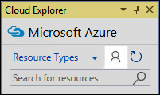

47.	Expand your account node, locate the **Storage Accounts** node, expand it, and finally, expand the **Blog Containers** node. You'll find your containers you created for your function.

	  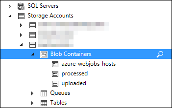

48.	Double-click on the **uploaded** container. If there are any items in the container, you'll see them in the document pane.
49.	On the toolbar you find an **Upload Blob**.

	  

50.	Click it, and Visual Studio opens the **Upload New File** dialog. Click the **Browse** button to locate a file to upload.
51.	Once you have, click OK to upload the image.
52.	Switch back to your web browser and you'll be able to see the Azure Function process the image by looking at the log.
53.	Return to Visual Studio and double-click on the **processed** container.
54.	You might need to click the **Refresh** button.

	  

55.	You should see your processed image with the "-thumb" suffix in the container.
56.	If you double-click on the image, it will download and the open in your default image viewer. 

## Part 2: Power BI, Azure Logic Apps, and Azure Functions

The Power BI Team at Microsoft has created a **Campaign/Brand Management for Twitter** solution template. This template helps you "analyze all your unstructured Twitter data" that is both scalable and extensible. You can use it to "track sentiment, topic trends and outreach for crucial occasions like events and campaigns, or continuously monitor user reactions to your products and services." This is something that would be a very useful companion the to the digital marketing solution.

The solution creates a number of artifacts in a Resource Group you specify. You should start with a separate resource group and then later if you want to keep it, you can move it to the same resource group as your main lab solution. 

In order to do this lab, you will need the following:

	An Azure Subscription
	A Twitter Account
	Power BI Desktop

1.	Navigate to [https://powerbi.microsoft.com/en-us/solution-templates/brand-management-twitter/](https://powerbi.microsoft.com/en-us/solution-templates/brand-management-twitter/ "Campaign/Brand Management for Twitter").
2.	Locate and click the **Install now** button. You will go through a number of steps including logging into Azure, connecting to Twitter, and ultimately deploying the solution into the Azure subscription you specify. 

	  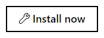

3.	Follow the instructions to perform the deployment. When you're done you find in your Azure subscription a rich set of items you can explore including an Azure Function and Logic App.

