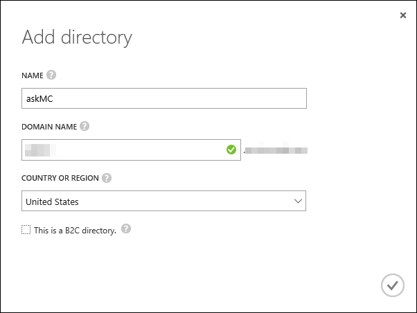
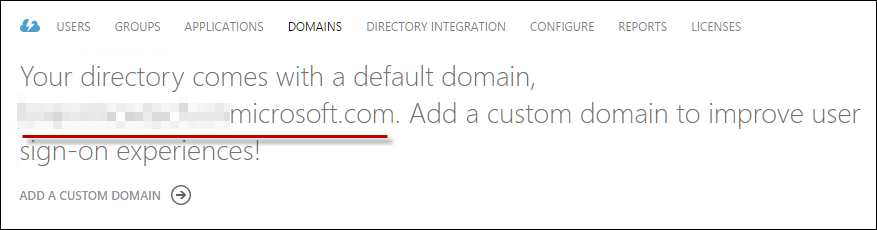
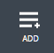
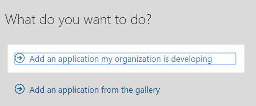
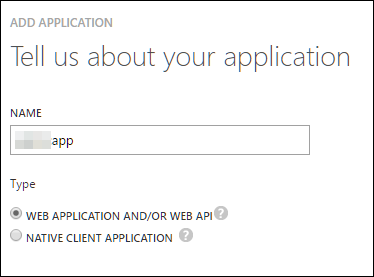
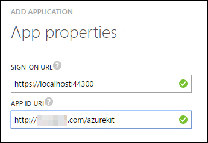
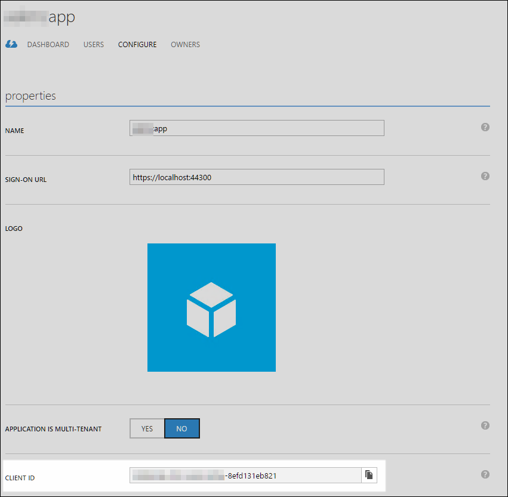
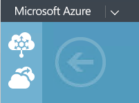
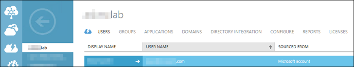

# Lab: VSTS Release Management

**This lab assumes you've completed the VSTS Team Build Lab**

In this lab you will create a two releases. One that can deploy the ARM template and either create or update your Azure resources. The second can deploy and update your web sites. 

### Par 1: Configure Azure Active Directory

This assumes you've not already done this as part of the [Deploy from Visual Studio 2015](./ReadMeVS2015.md) getting started process.

1. Access the legacy Azure Portal at <http://manage.windowsazure.com> to configure Azure Active Directory (Azure AD) for your application.

   > This is the old Azure management portal which you still need to use in order to manage some resources that have not moved completely to the new Azure Portal.

1.  Scroll down in the left navigation pane and select the Active Directory option.

	 

1.  Click the **+ NEW** button at bottom.

     

1.  Select **APP SERVICES | ACTIVE DIRECTORY | DIRECTORY | CUSTOM CREATE**.

     

1.  Provide a **Name** for your directory.

1.  Provide a unique **Domain Name**.

1.  Select the appropriate **Country or Region**.

1.  ***Do not*** check **This is a B2C directory**.

     

1.  Click the **Check Mark**.

1.  Select your new directory.
 
1.  Click the **Domains** tab to view the domains associated with your directory.
 
     
 
1.  You will see one default domain associated with the directory. Make note of this directory name as you will need it later for the web.config value **ida:Domain**.
 
      > **Note** You will want to  record (in a text editor like Notepad for example) three values: **ida:Domain**, **ida:ClientId**, and **ida:TenantId**. You will be adding them to a debug file in Visual Studio and you will need to add them to your web application's settings in Azure. 
 
      
 
1.  Click on the **Applications** tab.
 
1.  Click the **Add** button in the bottom toolbar area to start the process of creating a new application.
 
      
 
1.  When prompted, choose to **Add an application my organization is developing**.
 
      
 
1.  Enter a **Name** for your application and leave the default selection for a **Web Application / Or Web API** selected.
 
      
 
1.  Then click the right arrow button to move to the next step.
 
1.  For the **Sign-on URL** enter [**https://localhost:44300/**](https://localhost:44300/).
 
     > **Note** This is the address your application will be using when developing locally. When you deploy to Azure you can change this value in the portal or setup a separate application for the instance when it runs in Azure (recommended).
 
1.  Enter a unique URI in the **App ID Uri** field for the application such as you company domain name and the application name. This is a unique logical identifier for your app.
 
      
 
     > **Note** Because the App ID URI is a logical identifier, it does not need to resolve to an Internet address.
 
1.  Click the check mark button to complete the application setup.
 
1.  Once Azure has created the application, select the **Configure** tab and scroll down to find the **Client ID**.
 
      
 
1.  Copy the **Client ID** value using the button next to the field and save it somewhere You will use this as the value for the **ida:ClientId** in web.config.
 
1.  Scroll down the page. In the **Single sign-on** section, you’re going to add a **Reply URL**.
 
1.  Open a new browser tab if necessary and navigate to <http://portal.azure.com> and location your Resource Group.
 
1.  In the Resource Group, find your web app’s **App Service** and select it.
 
      
 
1.  In the App Service **Essentials** section, copy the URL.
 
1.  Return to your browser window where you’re editing the Azure AD settings and add the URL you just copied as a **Reply URL** but change the protocol from **HTTP** to **HTTPS**.
 
1.  Click the **Save** button at the bottom.
 
      
 
1.  Click the bottom toolbar button labeled **View Endpoints**.
 
      
 
1.  You need to copy the tenant ID from any one of the URLs provided in the dialog. The tenant ID will be the GUID/Unique identifier (a set of hexadecimal characters seperated by dashes) immediately following the login domain. This will be used for the **ida:TenantId** in web.config.
 
     > **Note** You may need to use the copy button to copy the entire URL, then paste into a text editor to selectively copy out just the tenant ID.
 
1.  Close the **App Endpoints** dialog. Now you will configure users.
 
1.  In the management portal, click the “back” arrow to return to the directory tenant page.
 
      
 
1.  Click the **Users** tab to view users for the tenant.
 
     > **Note** Make sure you are not on the tab of the same name for the application as that is for specific assignment of users to allow them access to the application.
 
      
 
1.  Take note of the existing user. It will be the account you’re using to manage the directory. If you plan to test with this users, you can move on to finish configuring the application in Visual Studio.
 
1.  Click the **Add User** button in the bottom toolbar to add a new user.
 
1.  You can choose to add a new user (that will be covered here) or add other users with existing Microsoft Accounts or from other Azure Active Directory instances, and even partner organizations. For this example, choose **new user in your organization**.
 
1.  Enter a user name unique to this directory and move to the next dialog in the wizard.
 
1.  Enter values for the names and select **User** for this example.
 
     > **Note** You are creating a user in this directory. If this is your company directory or a production directory, be careful who you add as you may be giving them rights to your organization, applications, or data.
 
1.  Make sure to only choose **User** for the role as this is the role in the organization, not your application.
 
1.  Move to the next dialog in the wizard and click the button to get the temporary password.
 
     > **IMPORTANT** Copy this value as it will not be presented again and you will need it to login to the application. You will have to change the password on first login. Note that you can change the password at a later time from the management portal if you forget it.
 
1.  Complete the wizard.
 

## Part 2: Create a Service Endpoint

In order to deploy your assets to Azure, you need a **Service Endpoint**.

1.	Access your VSTS Team Project.

1.	From the **Configure** menu , select **Services**.

1.	Select **New Service Endpoint**.
 
1.	From the list select **Azure Resource Manager**.

1.	Provide a **Connection name** that makes sense.

1.	Select your **Subscription**.
 
1.	Click **OK**.

## Part 3: Create a Release for Infrastructure

In this lab part, you will create a build that deploys your ARM template to Azure.

1.	Access the **Build & Release** Hub in VSTS.

1.	Select **Releases** and click the **** button and then **Create release definition** from the drop down.

1.	Select **Empty** from the list of templates and click **Next**.
	
1.	For the **Source (Build definition)**, select **CD Artifact Creation AzureKit - Server Only**.
	
1.	Click **Create**.
	
1.	Click **Add tasks**.
	
1.	From the list of **Deploy** tasks, select **Azure Resource Group Deployment** and click **Add**.
	
1.	Click **Close**.
	
1.	For **Azure Subscription**, select the **Service Endpoint** you created earlier.
	
1.	For the **Resource Group**, select your **Resource Group** you used earlier in the labs. If you didn't do the Azure labs, you can type a name here.
	
1.	Select the correct **Location**.
	
1.	In the **Template** field, enter **$(System.DefaultWorkingDirectory)/Build Packages/ARMTemplates/AzureKit.json**.
	
1.	In the **Template Parameters** field enter, **$(System.DefaultWorkingDirectory)/Build Packages/ARMTemplates/AzureKit.parameters.json**.
	
1.	In **Override Template Parameters**, enter the following **-AppPlanSKU Standard -NamePrefix %template% -SqlAdministratorLoginPassword (ConvertTo-SecureString -String '%yourpassword%' -AsPlainText -Force)**. Replace %template% with your prefix and %yourpassword% with your password.
	
1.	Change the **Deployment Mode** to **Complete**.
	
1.	Change the **Environment1** label to **SharedDev**.
	
1.	Change the **Definition** name to **Infrastructure Deployment--AzureKit - Server Only**.

1.	Click **Save**.

1.	In the dialog, enter **Initial deployment for SharedDev** and click **OK**.

1.	Click the ** Release** button and choose **Create Release** from the drop down menu.

1.	Watch the release run and verify the deployment.

## Part 4: Create a Release for Web sites

This part requires Part 1 to be completed. Part 2 is optional if you've manually created a deployment.

1.	Access the **Build & Release** Hub in VSTS.

1.	Select **Releases** and click the **** button and then **Create release definition** from the drop down.

1.	Select **Azure App Service Deployment with Slot (PREVIEW)** from the list of templates and click **Next**.
	
1.	For the **Source (Build definition)**, select **CD Artifact Creation AzureKit - Server Only**.
	
1.	Click **Create**.

1.	Select the **Deploy Azure App Service to Slot**.
	
1.	For **Azure Subscription**, select the **Service Endpoint** you created earlier.

1.	In the **App Service name**, select your **website** App Service.

1.	For the **Resource Group**, select your **Resource Group** you used earlier.
	
1.	For the **Slot** select **staging**.
	
1.	For the **Package or Folder** enter **$(System.DefaultWorkingDirectory)/Build Packages/drop/AzureKit.zip**.

1.	Select the **Manage Azure App Service - Slot Swap** task.

1.	For **Azure Subscription**, select the **Service Endpoint** you created earlier.

1.	In the **App Service name**, select your **website** App Service.

1.	For the **Resource Group**, select your **Resource Group** you used earlier.
	
1.	For the **Source Slot** select **staging**.

1.	Change the **Environment1** label to **SharedDev**.
	
1.	Change the **Definition** name to **Site Deployment--AzureKit - Server Only**.

1.	Click **Save**.

1.	In the dialog, enter **Initial deployment of sites for SharedDev** and click **OK**.

1.	At this point you've only done the main web site, you need to now configure the API site and the Management site. Click **Add tasks**.

1.	Find, select, and add **Azure App Service Deploy**.

1.	Find, select, and add **Azure App Service Manage (PREVIEW)**.

1.	Repeat the last two steps.

1.	Select *first* newly added **Azure App Service Deploy** task.
	
1.	For **Azure Subscription**, select the **Service Endpoint** you created earlier.

1.	In the **App Service name**, select your **apisite** App Service.

1.	Check **Deploy to slot**.

1.	For the **Resource Group**, select your **Resource Group** you used earlier.
	
1.	For the **Slot** select **staging**.
	
1.	For the **Package or Folder** enter **$(System.DefaultWorkingDirectory)/CD Artifact Creation AzureKit - Server Only/drop/AzureKit.Api.zip**.

1.	Select *first* newly added **Swap Slots** task.

1.	For **Azure Subscription**, select the **Service Endpoint** you created earlier.

1.	In the **App Service name**, select your **apisite** App Service.

1.	For the **Resource Group**, select your **Resource Group** you used earlier.
	
1.	For the **Source Slot** select **staging**.

1.	Select *second* newly added **Azure App Service Deploy** task.
	
1.	For **Azure Subscription**, select the **Service Endpoint** you created earlier.

1.	In the **App Service name**, select your **managementsite** App Service.

1.	Check **Deploy to slot**.

1.	For the **Resource Group**, select your **Resource Group** you used earlier.
	
1.	For the **Slot** select **staging**.
	
1.	For the **Package or Folder** enter **$(System.DefaultWorkingDirectory)/CD Artifact Creation AzureKit - Server Only/drop/AzureKit.Management.zip**.

1.	Select *second* newly added **Swap Slots** task.

1.	For **Azure Subscription**, select the **Service Endpoint** you created earlier.

1.	In the **App Service name**, select your **managementsite** App Service.

1.	For the **Resource Group**, select your **Resource Group** you used earlier.
	
1.	For the **Source Slot** select **staging**.

1.	Click **Save**.

1.	In the dialog, enter **Updated deployment of sites for SharedDev** and click **OK**.

1.	Click the ** Release** button and choose **Create Release** from the drop down menu.

1.	Watch the release run and verify it completes.

1.  In Azure, add the names and values for the following three values to your **Application Settings** in Azure for your Management Site.
 
     - ida:ClientId
     - ida:TenantId
     - ida:Domain

