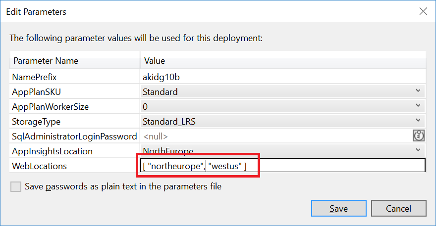
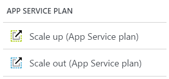

# Lab: Scaling and Availablility

In this lab, you will explore the various ways in which you can scale your Azure
services up or out to accommodate greater load.

## Part 1: Multi-region Deployment

The full template (`AzureKit.json`) in the deployment project is able to deploy
web sites to multiple geographic regions. By default, it will deploy only to a
single region - whichever one you select when creating the resource group. However,
you can specify a list of region names when deploying the template and for each region
listed it will create an Azure App Service instance, public-facing Web and API sites,
and a local Redis Cache. It configures Azure Traffic Manager to make these sites
available behind a single URL, arranging for requests to be directed to whichever
services is nearest to the user.

This is not purely a scaling feature. In fact, this will only improve your scalability
if your users are geographically distributed. If all of your users happen to be in the
same city, this Traffic Manager configuration won't help you much. (It is possible to
configure Traffic Manager to work in a 'round robin' way instead of distributing
requests to the nearest server, but that's not how the Azure Kit template sets it up.)
But if your users are distributed fairly evenly across the regions to which you
deploy, then this use of Azure Traffic Manager in effect provides a kind of load
balancing, enhancing scalability.

This multi-region approach offers two other important benefits (and for some applications,
these may well be the main reason to use it - it may be possible to achieve the scale
you required without using Traffic Manager, but you may still want either of both of
these other benefits):

 * Lower page load times across all regions
 * High availability - Traffic Manager can detect when regions become unavailable,
   and route to alternatives

With a web site deployed to a single region, users who happen to be further away from
the server will experience worse page load times because of how long it takes
information to travel around the globe. (For example, using a US web site from the UK
entails noticeable delays.) But if Traffic Manager can route your request to a server
that is much closer, these delays go away.

To try this out you will need to deploy the template specifying a list of regions
in the template parameters:

## Part 2: App Service Plan

You can change the amount of compute resource available to your Web Site and API App
by changing the Azure App Services settings. There are two ways to adjust this: you
can scale up or out.

You can scale up by changing the class of virtual machine that hosts your apps. The
template creates the smallest type by default - a single-core VM with 1.75GB of RAM.
You can change this to either a two-core, 3.5GB VM or a 4-core 7GB VM.

You can also scale out by changing the number of VMs Azure creates for hosting your
service plan. With the Standard pricing tier that the template uses by default, you
can raise this as high as 10 VMs (regardless of which VM size you have scale up to).
And if you switch to the premium tier you can go up to 20 VMs. You can choose to scale
up either by a fixed number (any number from 1 to the maximum allowed by your chosen
pricing tier), or you can ask Azure to scale up and down automatically, either according
to a fixed schedule, or dynamically based on the average CPU load across the servers,
enabling you to respond to increases in load without having to pay for large numbers
of VMs in quiet times.

You can configure both kinds of scaling in the Azure portal by finding the App Service
and then going to the blade's APP SERVICE PLAN section, where you will find an icon
for each kind of scaling.

## Part 3: Redis Cache

The Azure Kit uses ASP.NET output caching, with the Redis Cache provider. This can
reduce load on both the DocumentDB storing the underlying page data, and also on the
Azure App Service VMs serving up the web pages. (There will always be some CPU load
for each web page even when a cached version is used, because the web server still
needs to run the code to fetch the page from the Redis Cache and deliver it as the
response. But this will typically be lower than rendering the entire page from
scratch.) Consequently, it is possible that the Redis Cache may become a bottleneck,
and that increasing App Service capacity by scaling up or out does not provide the
capacity you need. You may need more Redis Cache capacity.

The ARM template supplied creates **C1 Standard** tier caches. This is the smallest,
lowest performance configuration recommended for production use. (There is a C0 size,
which is smaller, but runs on a shared VM, and is intended for dev/test scenarios.
There is also a cheaper tier, Basic, but again, this is recommended only for dev/test
because it runs as a single node and therefore cannot offer an SLA.) C1 Standard offers
1GB of cache, runs on a 1-core server, and offers 100Mb/s of bandwidth. For the Azure Kit,
which uses Redis to cache only text data (it uses Azure CDN to provide global scale
for images and video), 1GB of cache will be sufficient for a lot of sites, but there
may be performance reasons to move to larger configurations. Each tier offers additional
bandwidth as well as extra memory; the higher tiers all offer at least 2 cores, but
there isn't a straightforward relationship between cores and bandwidth, so see
[https://docs.microsoft.com/en-us/azure/redis-cache/cache-faq](https://docs.microsoft.com/en-us/azure/redis-cache/cache-faq) for details.

You can also upgrade to the Premium tier. These run on higher-end hardware, so the
per-CPU performance is higher, as is the available bandwidth - the P4 configuration
offers 4Gb/s of network bandwidth, for example (whereas the Standard tier tops out
at 2GB/s). The premium tier also supports sharding of data across multiple servers,
which can increase throughput further - you could for example have 10 P4 nodes, which
will be able to support around 2.5 million requests per second (as long as the sharding
successfully distributes work evenly across all nodes).

## Part 4: DocumentDB

The Azure Kit uses a single DocumentDB instance to store all the site content.
It uses Redis Cache to minimise the load, but there will always be some load on the
DocumentDB instance (the exact level depending on the cache hit ratio - a small site
with a few pages will typically make great use of the cache, but a very large site
with many infrequently-used pages might see less benefit from the cache). So it may
be necessary to increase the DocumentDB performance capacity to be able to scale.

With DocumentDB, you pay to reserve a certain amount of capacity by paying for a
fixed number of 'Request Units' (RU) per second. (The exact number of RUs you consume
will depend not just on the number of requests per second, but also the complexity of
those requests. The harder the server has to work to perform a query, the more RUs you
will need to be able to support a particular request rate.) The ARM template for the
Azure Kit configures the minimum, 400 RUs/second. You can change this very easily by
going to the blade for your DocumentDB in the Azure portal and selecting the 
'Scale' icon. This shows a dropdown listing all the collections in your DB, and the
Azure Kit uses just one collection, so there will be one entry. You can change the
number of RU/s to anything from 400 to 10,000.

If you need to go above 10,000 RU/s, it is possible, but some work is required. You
would need to use a differnt kind of collection. When you create a collection in a
DocumentDB, you need to select between two maximum capacities - either 10GB or
250GB, and this has an impact on available RU/s. When you make this choice you are
in effect choosing whether you want a collection that runs on a single node, or
which shards its data across multiple nodes. The latter can scale to higher capacity
in terms of both data storage and performance. With multi-node collection you can
reserve up to 250,000 RU/s. So you might be wondering why you would ever choose not
to go straight for a multi-node collection. The answer is that the minimum price for
a multi-node collection is much higher - you cannot currently configure such a collection
with less than 10,100 RU/s of performance capacity. This makes the minimum cost of
entry for a multi-node collection around 25 times higher than for a single-node one.

If you start with a single-node collection and discover you need to move to a multi-node
one, you will need to use the migration tools supplied by Microsoft - there is no
automatic way to switch a collection from one mode to the other.

Be aware that DocumentDB has another mechanism for enhancing scalability, particularly
for sites that have web apps in multiple regions: it is possible to configure DocumentDB
to replicate its content automatically to multiple regions. Since the Azure Kit will
typically be a read-often, write-occasionally system, this can be particularly effective.
The reason the Azure Kit doesn't take advantage of this is that it already deploys a
Redis Cache to every region in order to reduce the load on the DocumentDB. This limits
the benefits that geographic of the DocumentDB can offer. But if we weren't using Redis
Cache, DocumentDB replication would be worth enabling.

## Part 5: SQL Server

The final component of the Azure Kit that could prove to be a performance bottleneck
is SQL Server. The site doesn't rely heavily on SQL - it uses it only to track which
users have opted into receiving notifications. (If you choose not to create a SQL
Server, the site will work, you just won't have access to this feature.) But for a
large enough site, it could still become a bottleneck. (Or, if you build on the Kit
and make greater use of SQL, that might be another reason to need to increase SQL
capacity.)

It is very straightforward to increase your SQL Server capacity. Select the blade for
your SQL Database (not the server) in the Azure Portal, and under Settings, select
**Pricing Tier (scale DTUs)**. The ARM template sets this to the smallest available
size, 5 DTUs. As with DocumentDB's RUs, SQL's DTUs (Database Transaction Units) are
a way to measure the rate at which requests can be handled that takes into account
the complexity of the request. For a particular level of complexity in your query,
you'll be able to run queries at some particular rate, and increating the available
DTUs will increase that rate. (Or, reducing the work that SQL has to do to perform
the query will also increase the rate at which you run requests.) DTUs blend CPU,
memory, and IO usage. See
[https://docs.microsoft.com/en-us/azure/sql-database/sql-database-what-is-a-dtu](https://docs.microsoft.com/en-us/azure/sql-database/sql-database-what-is-a-dtu)
for more information about DTUs.

