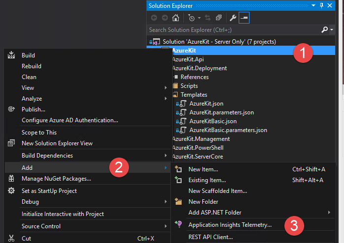
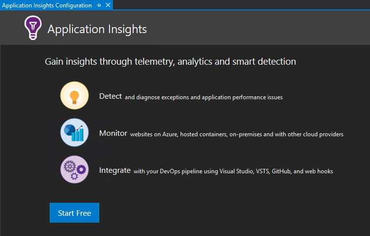
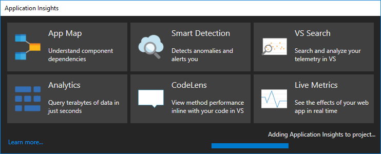
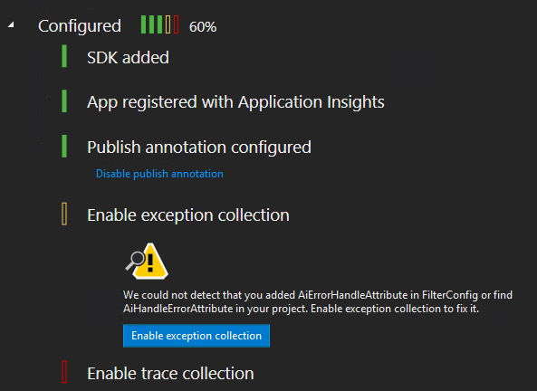
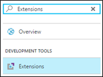
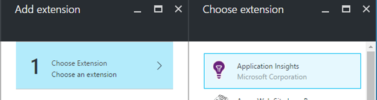
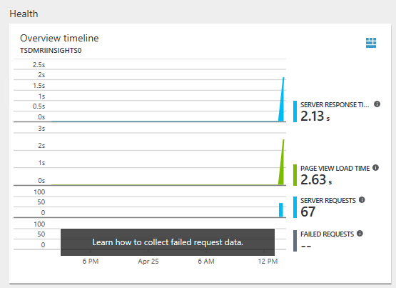

# Lab: Application Insights

**This lab assumes you’ve completed the VSTS Release Management Lab**

Application Insights provides live monitoring of your applications. You can detect and diagnose faults and performance issues, as well as discover how users are using your app.

In this lab, you will use an Application Insights instance defined by the kit’s ARM template and enable your Application to add telemetry.

There is one exercise in this lab (but more will be added shortly):

1.  Configure Application Insights for your Web App

Part 1: Configure Application Insights for your Web App
=======================================================

As part of the ARM template definition, there is an Azure Application Insights Resource in your Resource Group. In this part, you will enable telemetry collection from the main web app.

1.  In Visual Studio, make sure the **AzureKit - Server Only** Solution is open.

2.  In the Solution Explorer, right-click on the **AzureKit** project in Solution Explorer and select **Add | Application Insights Telemetry**.

	 

1.  In the **Application Insights** tab that opens, click the **Start Free** button.

	

1.  Verify the correct account and subscription are showing.

1.  The **Resource** field is a drop-down list that will show every **Application Insights** instance in your Azure Subscription, along with the option to create a new one (which is selected by default). Select the **AzureKit** Application Insights instance you just created.

	

1.  Click the **Register** button.

    This will add the **Microsoft.ApplicationInsights.Web** and **Microsoft.ApplicationInsights.JavaScript** NuGet packages to your project. It adds entries to the **Web.config** file to ensure Application Insights can get access to information about what your application is doing. It also adds a new **ApplicationInsights.config** file configuring how the SDK collects information. Furthermore, it adds code to collect detailed error information.

    Once it has finished you should see something like this:

	

1.  Click **Finish** and then you will see this in the **Application Insights** panel:

	

1.  Visual Studio is often a little behind the latest version of the Application Insights SDK, and the Azure Portal might complain, so you should right click on the **Rg.Web** project’s **References** node and select **Manage NuGet Packages**. Select the **Updates** page. If updates for any packages with names starting **Microsoft.ApplicationInsights** are available, select each one and click **Update**.

1.  Close the NuGet window.

1.  Build the AzureKit project.

1.  Press **F5** to run the application locally. Navigate around the application a little bit.

1.  Return to Visual Studio, stop debugging, and then right-click on **AzureKit** and select **Application Insights | Search Debug Session Telemetry**. This shows all of the events captured by Application Insights.

    This verifies that events are being captured correctly, so now let’s deploy to Azure.

1.  Commit your changes locally and this push to VSTS.

1.  Check and make sure the CI build completes.

1.  Deploy the update from VSTS using the **Site Deployment--AzureKit - Server Only** release in Release Management.

    Once deployment is complete, you need to enable the Application Insights extension for the Web App in Azure—this enables Application Insights to capture some additional detail that you won’t get by installing the SDK alone. (Specifically, it enables Application Insights to inject code into your app, enabling it to hook into places that would otherwise be inaccessible. For example, although you will see information about the timing of calls made to SQL Server even using just the SDK, you will only be able to see which particular SQL queries were executed if you enable the Application Insights extension in the Azure portal.)

1.  Select you’re the main Web App in the Azure Portal. Type **Extensions** into the **Search** textbox.

 	

1. Select **Extensions** under **DEVELOPMENT TOOLS**.

1. Click the **+ Add** button at the top of the pane to add an extension.

1. In the **Choose an extension** panel that opens, select **Application Insights**.

    

1. Click **OK** to accept the legal terms.

1. Click **OK** to add the extension.

1. Next, you need to ensure that there’s some information for Application Insights to analyze, by using your web site. Open your deployed main site in a web browser, and navigate around a little more to generate some more telemetry. Make sure that the last thing you do is return to the Home page (or refresh it if you’re already there) so that you can follow the next steps in this walkthrough.

1. Back in the Azure Portal, open the Application Insights instance (it will end in **Insights0**). You should see some overview information about your application’s health:

	

    > (If you see nothing, give it a minute or two—it can take a short while for information to come through when you have just set up a new instance.)

    > You should see server response time data, page view load time, and server requests.

Let’s review what you have done. You used the Application Insights instance defined by the ARM template to collect information about your Web App, and you configured your Web App to send diagnostic data to that instance. Right way you now have the ability to collect telemetry and behavior data for your app.
