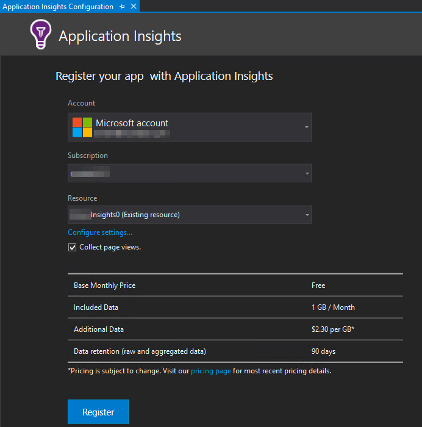
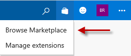
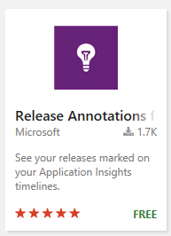
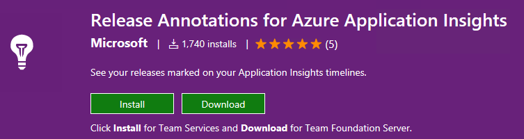
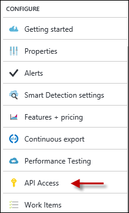
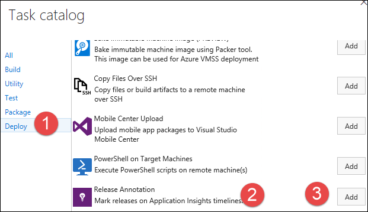
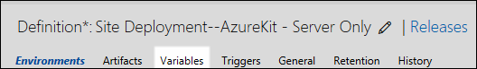
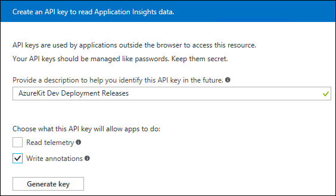
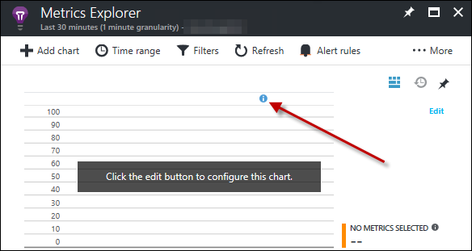
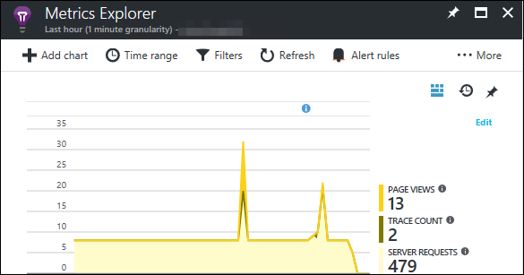

# Lab: Application Insights

**This lab assumes you’ve completed the VSTS Release Management Lab**

Application Insights provides live monitoring of your applications. You can detect and diagnose faults and performance issues, as well as discover how users are using your app.

In this lab, you will use an Application Insights instance defined by the kit’s ARM template and enable your Application to add telemetry. In addition you’ll use Application Insights Release Annotations to see deployments and how the map to your telemetry.

There is two parts in this lab:

1.	Configure Application Insights for your Web App
2.	Release Annotations

Part 1: Configure Application Insights for your Web App
=======================================================

As part of the ARM template definition, there is an Azure Application Insights Resource in your Resource Group. In this part, you will enable telemetry collection from the main web app.

1.  In Visual Studio, make sure the **AzureKit - Server Only** Solution is open.

2.  In the Solution Explorer, right-click on the **AzureKit** project in Solution Explorer and select **Add | Application Insights Telemetry**.

	 

1.  In the **Application Insights** tab that opens, click the **Start Free** button.

	

1.  Verify the correct account and subscription are showing.

1.  The **Resource** field is a drop-down list that will show every **Application Insights** instance in your Azure Subscription, along with the option to create a new one (which is selected by default). Select the **AzureKit** Application Insights instance created via the ARM template (it will end in **Insights0**).

	

1.  Click the **Register** button.

    This will add the **Microsoft.ApplicationInsights.Web** and **Microsoft.ApplicationInsights.JavaScript** NuGet packages to your project. It adds entries to the **Web.config** file to ensure Application Insights can get access to information about what your application is doing. It also adds a new **ApplicationInsights.config** file configuring how the SDK collects information. Furthermore, it adds code to collect detailed error information.

    Once it has finished you should see something like this:

	

1.  Click **Finish** and then you will see this in the **Application Insights** panel:

	

1.  Visual Studio is often a little behind the latest version of the Application Insights SDK, and the Azure Portal might complain, so you should right click on the **Rg.Web** project’s **References** node and select **Manage NuGet Packages**. Select the **Updates** page. If updates for any packages with names starting **Microsoft.ApplicationInsights** are available, select each one and click **Update**.

1.  Close the NuGet window.

1.  Build the AzureKit project.

1.  Press **F5** to run the application locally. Navigate around the application a little bit.

1.  Return to Visual Studio, stop debugging, and then right-click on **AzureKit** and select **Application Insights | Search Debug Session Telemetry**. This shows all of the events captured by Application Insights.

    This verifies that events are being captured correctly, so now let’s deploy to Azure.

1.  Commit your changes locally and this push to VSTS.

1.  Check and make sure the CI build completes.

1.  Deploy the update from VSTS using the **Site Deployment--AzureKit - Server Only** release in Release Management.

    Once deployment is complete, you need to enable the Application Insights extension for the Web App in Azure—this enables Application Insights to capture some additional detail that you won’t get by installing the SDK alone. (Specifically, it enables Application Insights to inject code into your app, enabling it to hook into places that would otherwise be inaccessible. For example, although you will see information about the timing of calls made to SQL Server even using just the SDK, you will only be able to see which particular SQL queries were executed if you enable the Application Insights extension in the Azure portal.)

1.  Select you’re the main Web App in the Azure Portal. Type **Extensions** into the **Search** textbox.

 	

1. Select **Extensions** under **DEVELOPMENT TOOLS**.

1. Click the **+ Add** button at the top of the pane to add an extension.

1. In the **Choose an extension** panel that opens, select **Application Insights**.

    

1. Click **OK** to accept the legal terms.

1. Click **OK** to add the extension.

1. Next, you need to ensure that there’s some information for Application Insights to analyze, by using your web site. Open your deployed main site in a web browser, and navigate around a little more to generate some more telemetry. Make sure that the last thing you do is return to the Home page (or refresh it if you’re already there) so that you can follow the next steps in this walkthrough.

1. Back in the Azure Portal, open the Application Insights instance (it will end in **Insights0**). You should see some overview information about your application’s health:

	

    > (If you see nothing, give it a minute or two—it can take a short while for information to come through when you have just set up a new instance.)

    > You should see server response time data, page view load time, and server requests.

Part 2: Release Annotations
=======================================================

Sometimes referred to as *deployment markers*, annotations flag new deployments to Azure in Application Insights with meta-data making it easy to correlate changes in telemetry to new deployments. In order to use annotations, you’ll need a free Visual Studio Team Service extension, an Application Insights instance (done in Part 1) and a release definition that deploys to Azure (done in the Release Management lab).

1.  Access your Visual Studio Team Services project.

1.  In the upper right corner, to the left of your identity badge and the Send-a-smile icon, is the Marketplace icon. Click it and choose the **Browse Marketplace** command.

	

1.  Search for **release annotations**.

1.  In the list that comes back, select the **Release Annotations** extension.

	

1.  Click the **Install** button and follow the prompts to install it into your account.

	

1.  Once you’ve installed the extension, access the Azure Portal.

1.  Open your deployment’s Resource Group and then select your Application Insights instance.

1.  In the list of commands, scroll down to the **Configure** section and choose the **API Access** command.

	

1.  In the blade that opens, copy the **Application ID** to the clipboard. **Leave the blade open**. You’ll come back.

1. Return to your Team Project in VSTS in your web browser.

1. Access the **Release** hub.

1. Open your **Site Deployment** Release in *edit* mode.

1.  Select the **Add tasks** command.

1.  In the **Task catalog**, with the **Deploy** tab selected, scroll and locate the **Release Annotation** task. Select it, and click **Add**.

	

1.  Close the **Task catalog**.

1.  Drag the new task to the top of the list of tasks.

1.  Select the new task.

1.  Now paste the **Application ID** you copied earlier into the **Application ID** field.

1.  Select the **Variables** tab for the release definition.

    

1.  In the Variables section add a new variable named **ApiKey**.

1.  Switch back to your open blade in the Azure portal where you have your Application Insights instance.

1. Click the **Create API key** button.

1. In the new blade, type **AzureKit Dev Deployment Releases** in the description field.

1. Check the **Write annotations** box and then click **Generate key**.

	

1. Copy the key and save it to a text file to make sure you don’t lose it.

1. Close the Create API key blade, and select the **Overview** command.

1. Return to VSTS and paste the API key into the variable’s value field.

1. Click the **Save** button to save your Release. For the **Comment**, enter something like **Added Application Insights Release Annotations support**.

1. Access your main web site and click on the various links.

1. Return to VSTS and deploy your updated release.

1. Once the release is done, return to your site and access some pages.

1. Now go to the Azure portal and your Application Insights blade.

1. Click the **Metrics Explorer** button. Without any data, you’ll already see the marker as a small information icon.

	

1. Click the **Edit** button for the top chart.

1. Under **Usage** check **Page Views** and **Trace count**.

1. Then expand **Server** and select **Server Requests**.

1. Close the **Chart Details**.

1. Click the **Time range** button and change the Time Range to the **Last hour**.

1. Click the **Refresh** button. You should now see data relative to your new deployment.

	

1. If you have time repeat the exercise of using the site, doing a new deployment, and accessing the site. Your chart will show the second marker.

    Let’s review what you have done. You used the Application Insights instance defined by the ARM template to collect information about your Web App, and you configured your Web App to send diagnostic data to that instance. Right way you now have the ability to collect telemetry and behavior data for your app. Next you added annotations so you can map site telemetry to changes caused by new releases of your site.
