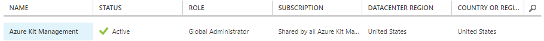
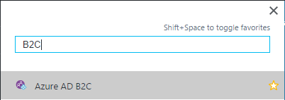

# Lab: Security

In this lab you will secure access to the management site, and optionally
enable users to log in to the main site and mobile API. (The main site and mobile
API can be used without authentication, so it is only useful if you want to store
persistent information for the user. The SQL Server lab later on requires
authentication on the main site.)

In both cases, we will be using Azure Active Directory (Azure AD for short), but in
slightly different ways. The management site will use an ordinary Azure AD directory,
and will only allow in users that a directory administrator has added to that directory.
The main site and mobile API will use an Azure AD B2C (Business to Consumer)
directory, which enables users to authenticate through various popular social media
sites, or with a Microsoft Account. With a B2C directory, users do not need to be
added in advance - you can define a policy that enables, say, any user who can
authenticate with a Microsoft Account to join.

## Part 1: Create Azure AD Directory for Management Site

First, you need to create a new directory in Azure AD. (The nomenclature gets a little
unwieldy: you're about to create a new Azure Active Directory directory - so good, they
named it twice. We can shorten this to 'Azure AD directory' but it's often abbreviated
further to just 'AD'. That doesn't help much because now 'AD' means two different
things, which is why some people prefer to use the other name for an Azure AD directory:
*tenant*. Azure AD is a multi-tenant service, meaning it can support multiple
customers, and each directory is a tenant of the service.)

A tenant (or directory) defines a set of users, and is able to authenticate them.
(Azure AD offers a few different mechanisms for this. It defaults to username/password,
but it also supports two-factor authentication, or it can use smartcard-based login,
or, in it can defer to external authorities such as the Microsoft Account
infrastructure.) You can also optionally define groups of users. And a tenant also
defines one or more *applications* which are allowed to use the tenant to log users
in. (If you want your web site to be able to authenticate users in a particular
tenant, you must define a corresponding application in the directory that lets
Azure AD know that the web site is authorized to do this. Likewise, if you want
to enable mobile or desktop clients to log users in through Azure AD, you need to
define an application in the tenant that permits this.)

You will already have at least one directory: any Azure subscription is associated
with one. If you signed up for your Azure subscription using a Microsoft account,
the directory will typically have a name based on your email address. For example,
if you are `jdoe@example.com` the tenant will be called something like
`jdoeexample.onmicrosoft.com`. If you use one of the business editions of Office 365
you will belong to a directory associated with your company's Office 365 subscription.
(It's possible that your Azure subscription is associated with the same tenant as your
company's Office 365 subscription - companies that supply multiple employees with
MSDN subscriptions often control access to these through Office 365 tenant, in which
case the Azure subscription included with each MSDN subscription will typically be
associated with that sema tenant.)

In general, you don't want to use the same directory for your Azure subscription and
applications that you host in Azure. You might not even have a choice - if the tenant
in question is your company's Office 365 tenant, you might not have the necessary
security access to define applications. In any case, the set of users who should
have access to your Azure subscription is very often going to be quite different from
the set of users who will be using some application you're hosting in Azure, and it
can simplify matters to define a tenant specifically for your application, so that's
what we'll be doing. And by creating a dedicated tenant just for our management site,
we can use a very simple policy: users can use the management site if and only if they
belong to its tenant.

1.  At the time of writing this lab, you cannot yet create a new Azure AD tenant
    in the Azure portal - you have to use the old Azure management site, which is
    at [https://manage.windowsazure.com/](https://manage.windowsazure.com/) - navigate
    there and log in if prompted.

2.  Once the management site has finished loading, look at the list of labelled icons
    on the left. Scroll down to find the **Active Directory** entry, which is near
    the bottom

    

3.  Click the Active Directory label. The management site shows you a list of all
    of the tenants for which you have administrator privileges. (If you access your
    Azure subscription through a corporate tenant, it's possible that this list will
    be empty, if you're not also an administrator of that tenant.) Near the bottom
    left of the page, click the **+ NEW** button.

    

4.  In the **NEW** panel that opens, the first two columns will already have
    selected **APP SERVICES** and **ACTIVE DIRECTORY** for you. In the third column,
    click **DIRECTORY**

    

    then click **CUSTOM CREATE**

    

5.  An **Add directory** dialog will appear. It requires you to enter both a
    **NAME** and a **DOMAIN NAME**. The name determines only how the directory
    appears in the Azure Management site and also the Azure Portal. (Although you
    can't yet create tenants in the Azure Portal, it does let you manage some aspects
    of them.) The domain name is different - it needs to be globally unique. If you
    try a name that is already in use by another tenant, the Azure Management site
    will tell you. Finally, you need to specify the main country or region that will
    be using this tenant. (Do **not** check the B2C checkbox.)

    

    **Note:** you will need the domain name later. Take a note of the value you
    entered. (You may find it convenient to open a text editor to collect this, and
    various other bits of information you'll be needing later.)

    Click the tick at the bottom right when you have filled this in.

6.  Once the directory is ready, it will appear in your list of tenants:

    

    Click on it in the name column.

7.  The Azure Management site will show the quickstart page for the tenant. We don't
    want this. Click on the **USERS** label near the top

    

    This will show a list of all the users in the tenant - currently just you. If you
    want to grant other users access to the management site, you'd do it by going to
    this page and then clicking the **ADD USER** button at the bottom of the page.
    However, we don't need to do that right now, although feel free to if you want.

**Note:** There are now two ways to proceed. In either case, you will create an
Application in your Azure AD tenant, and configure your Azure Kit management web
site to use it, but you can either get Visual Studio to do all the work for you,
or you can do it by hand. It's easiest to let Visual Studio do it, and if that's
what you want, proceed to Part 2. However, that will hide some important details, and
if you'd like to see exactly what's going on, skip Part 2, and go straight to Part 3.

## Part 2: Configure the Management Web App

Now that you have a tenant, you can configure the management app to use it. In fact
Visual Studio can do most of the work - it can create the application in the tenant
for you.

1.  In Visual Studio, right click on the **AzureKit.Management** project and selected
    **Publish**. Use the **Prev** or **Next** buttons to move to the **Settings** page.
    Last time you published, you unchecked the **Enable Organizational Authentication**
    checkbox. Now you need to check it:

    

    In the **Domain** text field, type in the domain name you used earlier when
    creating the tenant, and then add `.onmicrosoft.com` to the end.

2.  Click **Publish**. Visual Studio will ask you to sign in:

    

    It needs you to log in as a Global Administrator of the tenant. There will be just
    one such adminstrator (unless you added more), and that will be whatever user
    account you logged into the Azure management site with. Log in using that same
    account.

3.  Once Visual Studio has finished deploying your app, it will open it in a web
    browser. Click the **Sign in** link. Log in if prompted. The first time you use
    the site you will see a consent prompt:

    

    Click **Accept**

    The main page of the Azure Kit management site will show, and this time it won't
    ask you to log in - it will show a series of links for managing various aspects
    of the site.

    **Note:** none of these will work yet! You have not yet created a DocumentDB
    instance to hold the content, so the management site will have nowhere to put
    it. You will need to complete the next lab before you will be able to use this.

Since Part 3 is an alternative to Part 2, you can now skip directly to Part 4.

## Part 3 (optional): Create the Application Manually

While it is convenient to have Visual Studio take care of setting up the app to
use the Azure AD directory you created, it does hide some important details, and it's
worth knowing what those are, because you may need to take control of this (e.g., if
you set up an automated deployment pipeline). Visual Studio did the follwing:

 * Create a new Application in the Azure AD tenant, configured to enable the
   Azure Kit management site to log users in using this tenant
 * Modified the `Web.config` file during deployment, setting the following values:
    * `ida:TenantId` to the GUID that uniquely identifies your tenant
    * `ida:Domain` to your tenant's domain name (including the `.onmicrosoft.com`
       suffix)
    * `ida:ClientId` to the GUID of the application it created in the tenant for you.

You could have gone through all these steps manually. The following steps describe
how to do it. You don't need to do this, because Visual Studio has already got things
working for you, so you can skip these and go straight to the next part. But if you
want to see exactly what Visual Studio did for you, you can do it all again by hand:

1.  In the Azure management site, on the page for your new directory, click the
    **APPLICATIONS** label near the top of the page:

    

2.  Near the bottom of the page, click the **ADD** button (**not** the **NEW** button;
    the one you want will be in the center).

    

3.  In the **What do you want to do** page that opens, select **Add an application
    my organization is developing**

    

    It will now ask for information about your app:

    

    The name you type here will be shown to users when they are asked to log into
    the app.

    Leave the radio button on **WEB APPLICATION AND/OR WEB API** and then click
    the arrow at the bottom right to move to the next page.

4.  Next, Azure wants you to enter a **SIGN-ON URL** and an **APP ID URL**:

    

    For the sign-on URL, enter the URL of the web app you created to host the Azure
    Kit management site. And you can use this same URL as the ID URI value too - it
    just needs to be a unique identifier.

    Click the tick at the bottom right when you are done. Azure will take a few
    seconds creating the app, and will then show you the quick start page for the app.

5.  Click the **CONFIGURE** label near the top of the page:

    

    Scroll down to find the **CLIENT ID**.

    

    Copy this value and save it somewhere - you will be needing it later (along with
    the domain name you noted down earlier).

6.  Scroll down to the **single sign-on** section and find the **REPLY URL**.
    this will currently have the value you entered as the sign-in URL when creating
    the application. If you used an HTTP URL (which is fine) you will need to edit
    this reply URL to be an HTTPS URL.

    

    Click the **SAVE** button at the bottom of the page.

    

7.  You need one last piece of information: the tenant ID. In addition to a unique
    domain name, all Azure AD tenants have a unique identifier (a GUID). This is
    useful because tenants can have multiple domain names, and you can change the domains
    over time, so  it's useful to have single canonical identifier that will never
    change. Unfortunately, the Azure management site doesn't make it particularly
    easy to find. One way to find it is to look in the address bar of your browser
    - it will have a URL with a `#` followed by the text
    `Workspaces/ActiveDirectoryExtension/Directory` followed by a GUID. That GUID is
    your tenant id. Alternatively you can click the **VIEW ENDPOINTS** button at
    the bottom of the screen:

    

    This shows numerous URLs all of which have a GUID directly after the slash
    that follows the hostname. It will be the same GUID in all cases, and this is
    also your tenant ID.

    Make a copy of the tenant ID and save it in the same place as the client ID and
    domain name you collected earlier.

8.  In Visual Studio, open the `AzureKit.Management` project's `Web.config` file,
    and find the `<appSettings>` section. Give  the `ida:ClientId`, `ida:TenantId`, and
    `ida:Domain` settings the values you noted down earlier for the application's
    client id, the tenant id, and the domain name you chose. For that last one,
    you will need to append `.onmicrosoft.com` to the name you chose.

9.  Right click the `AzureKit.Management` project in **Solution Explorer** and select
    **Publish**. Click the **Publish** button.

10. Once Visual Studio has finished deploying your app, it will open it in a web
    browser. Click the **Sign in** link. Log in if prompted. The first time you use
    the site you will see a consent prompt:

    

    Click **Accept**

    The main page of the Azure Kit management site will show, and this time it won't
    ask you to log in - it will show a series of links for managing various aspects
    of the site.

    **Note:** none of these will work yet! You have not yet created a DocumentDB
    instance to hold the content, so the management site will have nowhere to put
    it. You will need to complete the next lab before you will be able to use this.

## Part 4: Create Azure AD B2C Directory for Public Site and Mobile API

The directory you created in the preceding parts secures access to the Azure Kit
management site. If a new user is to gain access to the site, someone with
administrator privileges for the tenant must add them. This is exactly what we want
for the management site - it shouldn't be open to anyone who discovers the URL. But
this is not a suitable approach for the main site.

The main site is designed to be open to all. In fact, it doesn't need authentication
at all - it can be used entirely anonymously. However, in one of the later labs
(the SQL Server lab), you will add a feature in which the user can opt in to (and back
out of) receiving email notifications of site updates. For that to work, we need some
way of authenticating users - we can't just let someone type in any old email address
and trust that it's valid. So although we won't force all users to log in, we will
need them to authenticate if they want to receive emails, and manage the settings for
that.

Fortunately, Azure AD can still help us. We can create a different kind of tenant: a
*B2C* (Business to Consumer) tenant. You may recall there was a checkbox for this when
you created the tenant earlier. If you select this option, the tenant behaves quite
differently. Instead of allowing in only those users explicitly added by a tenant
adminstrator, you can configure a B2C tenant to allow in any user at all. AAD still
requires them to authenticate, but there are a few ways it can do this. You can configure
it to allow anyone with a Microsoft Account (formerly called a Live ID) to log in.
You can also enable login through Google, Facebook, LinkedIn, or Amazon accounts.
Furthermore, Azure AD can authenticate users directly through their email address -
if you enable this, users will be able to enter an email address, and it will send
an email containing a verification link to enable them to prove that they own the
email address.

1.  Go to the Azure management site (not the portal) at
    [https://manage.windowsazure.com/](https://manage.windowsazure.com/) and as
    with earlier in this lab, scroll down through the icons on the left to find the
    **Active Directory** entry, which is near the bottom.

    

2.  As before, click the **+ NEW** button near the bottom left of the page:

    

3.  In the **NEW** panel that opens, the first two columns will already have
    selected **APP SERVICES** and **ACTIVE DIRECTORY** for you. In the third column,
    click **DIRECTORY**

    

    then click **CUSTOM CREATE**

    

4.  An **Add directory** dialog will appear. As before, enter a
    **NAME** and a **DOMAIN NAME**. These should be different than the ones you used
    when creating the tenant for the management site. Select your country
    
    Unlike last time, you should check the B2C checkbox.

    

    Azure might show you a warning indicating that this will be a slow operation -
    B2C tenants take longer to create than normal ones.

    **Note:** you will need the domain name later, so as with last time, take a note
    of the value you entered.

    Click the tick at the bottom right when you have filled everything in. Wait until
    the tenant has been created. (Watch the progress information at the bottom of the
    screen.)

5.  Once the directory is ready, it will appear in your list of tenants. Strangely,
    although you need to use the old Azure Management site to *create* a B2C tenant,
    the only way to *configure* a B2C tenant is in the newer Azure portal. So you will
    now need to navigate to [https://portal.azure.com/](https://portal.azure.com/)

    **Note:** even if you have the portal open in a browser, it is worth opening a new
    tab, because as you will see, it is tricky to navigate between the pages for
    configuring a B2C tenant, and the pages for configuring your web apps.

6.  At the top right of the portal is a button showing your username and the name
    of the tenant associated with your subscription. If you click this, it shows a
    list of tenants that you belong to:

    

    This will include the new B2C tenant that you just created. Select that.

7.  Once you have selected the B2C tenant, you will see a fresh dashboard - none of
    the resources you created earlier will be visible. This is because you can only
    access resources in Azure subscriptions associated with the selected tenant, and
    there are no Azure Subscriptions associated with this new tenant. (Each Azure
    subscription is controller by exactly one Azure AD tenant, and creating a new
    tenant doesn't change that. You can move subscriptions between tenants if you
    want to, but it doesn't happen automatically. So a freshly-created tenant will
    never have any associated Azure subscriptions to begin with.) This is why we
    recommended that you use a new browser tab for this work - by switching tenants,
    you cause all your Azure resources to become inaccessible. (Obviously you can
    switch back, but then you won't be able to configure your new B2C tenant.)

8.  On the left hand side, click the **More services** label:

    

    In the filter textbox that appears, type **B2C**, at which point you should see
    an **Azure AD B2C** entry in the list. Click on the star to the right of this, to
    pin this to the list of icons and labels on the left of the page.

    

9.  Click on the new **Azure AD B2C** label that just got added to the list on the left.
    The Azure portal will show the blade for configuring your B2C tenant. (It might show
    a big warning telling you that this tenant is not associated with a subscription.
    You can ignore that for these labs.)

10. You must first tell Azure AD which identity providers to use, and supply it with
    the details it requires to work with them. In the **Settings** column, click the
    **Identity providers** entry. It will initially show that no social identity
    providers have been configured. Click the **+ Add** button at the top of the blade.

    In the **Add social identity provider** blade that opens, enter *MSA* in the
    **Name** field, then click on **Identity provider type**. In the list that
    appears, select **Microsoft Account**.

    

    Click **OK**.

11. Back in the **Add social identity provider** blade, click **Set up this
    identity provider**. This will show a blade asking for the **Client ID** and
    **Client Secret**. These are values that you need to obtain from the Microsoft
    Account system, so you will need to go to
    [http://go.microsoft.com/fwlink/p/?LinkId=262039](http://go.microsoft.com/fwlink/p/?LinkId=262039)
    and log in with a Microsoft Account.

12. In the **My applications** page find the **Live SDK applications** section, and
    click its **Add an app** button. (There will be more than one such button - make
    sure to click the one in the right section.) Enter a name for the application:

    

    Click **Create application**

13. In the page that opens representing the new application, you will see some details:

    

    This contains the two values you need. Copy the **Application Id** in the
    **Properties** section and past it into the **Client ID** field in the browser
    tab in which you're setting  your B2C tenant. Then in the **Application Secrets**
    section, copy the string of random looking characters in that section and
    paste it in as the **Client secret** for the B2C settings.

    You can click **OK** in the B2C settings now, and then click **Create**.

    You're not yet done with the Microsoft Account settings though. You need to give
    it the URL that Azure AD will supply as a redirect URL during log in. This URL
    will have the following form:

    `https://login.microsoftonline.com/te/YOUR-TENANT-ID/oauth2/authresp`

    You will need to replace `YOUR-TENANT-ID` with your tenant's unique GUID.
    To discover your B2C tenant's ID, you'll need to go back to the Azure management
    site. If you're not already there, go to the page for your B2C tenant, and then
    look in the address bar - it will have a URL with a `#` followed by the text
    `Workspaces/ActiveDirectoryExtension/Directory` followed by a GUID. That GUID is
    your tenant id.

    Enter this in the **Redirect URIs** section of the **Web** block under
    **Platforms** in the Microsoft Account application page:

    

    Click **Add Url**. Then at the bottom of the page click **Save**

    You have now completed the Microsoft Account configuration.

14. Back in the Azure portal, you will also need to configure a *Sign In/Sign Up*
    policy for your B2C tenant, to tell it who should be allowed to log into the
    site. Close the **Identity provider** blade if it is still open, then in the
    **Settings** blade, under **POLICIES** select **Sign-up or sign-in policies**

    

    In the **Sign-up or sign-in policies** blade that opens click the **+ Add** button.

    

15. In the **Add policy** dialog set the name to **SignUpOrIn**. Click on **Identity
    providers** and then check the **MSA** checkbox.

    

    Click **OK**.

    Select **Sign-up attributes**. In the **Select sign-up attributes** blade,
    check **Display Name** and **Email Address**
    
    

    Click **OK**.

    Select **Application claims**, and again check **Display Name** and **Email Address**
    then click **OK**.

    Click **Create** in the **Add policy** blade.

## Part 5: Configure the Main Site to use your B2C Tenant

1.  First, you will need to create an application - remember Azure AD will only allow a web
    site to authenticate users through a tenant if you define a corresponding application.
    In the **Settings** blade select **Applications**. In the blade that opens, click
    **+ Add**.

    In the **New application** blade, set the **Name** to **Azure Kit Web**. Under
    **Include web app/web API** click **Yes**. Leave **Allow implicit flow** at **Yes**
    then in the **Reply URL** enter the URL for your Azure Kit main site, specifying `https`.

    

    Click **OK**

    After a few seconds, the application will appear in the **Applications** blade. Note
    down the **APPLICATION ID** because you will need this.

2.  In Visual Studio, open the **AzureKit** project's **Web.config** file, and find the
    `appSettings` section. Set the **ClientId** to the ID of the application you just
    created. Set the **TenantId** to the ID for your B2C tenant that you discovered
    earlier when setting up the Microsoft Account reply URL.

    For the **B2cSignInOrUpPolicy** you need the name of the policy you created, but
    it won't have the exact name you chose when you created it. In the **Settings**
    blade for your B2C tenant, select **Sign-up or sign-in policies**. The list
    may take a few seconds to populate, but when it does it will show the name Azure AD
    has chosen for the policy. It will be something like **B2C_1_SignUpOrSignIn**.
    Whatever value is shown, use that as the **B2cSignInOrUpPolicy** in your `Web.config`.

3.  Publish the main site again. (Right click the **AzureKit** project in Solution Explorer,
    select **Publish** then click **Publish**.)

4.  When the web site opens in a browser, click the **Sign in** link at the top right. You
    might find that it goes straight to a page in which it shows your email address and a
    default display name, and offers a **Continue** button. If you see this, what has happened
    is that Azure AD remembers your identity and has not asked you to sign in again. In this case,
    to see the whole login flow, try opening a browser in a 'private' mode. (E.g., if you're using
    Chrome, select **New incognito window** from its menu at the top right; if using Edge,
    select **New InPrivate Window** from its menu at the top right.) You should see a normal
    Microsoft Account prompt:

    

    Log in with your Microsoft Account, and once you have, you will then be redirected back
    to the Azure Kit site as an authenticated user.

## Part 6: Configure the Mobile API to use your B2C Tenant

1.  You will need to create another application for the mobile API because in B2C tenants,
    applications can only redirect to one domain. In the **Settings** blade select
    **Applications**. In the blade that opens, click **+ Add**.

    In the **New application** blade, set the **Name** to **Azure Kit API**. Under
    **Include web app/web API** click **Yes**. Leave **Allow implicit flow** at **Yes**.

    For the **Reply URL**, start with the URL for your Azure Kit API site, specify `https`,
    and then on the end, add `.auth/login/aad/callback`

    Click **OK**

    After a few seconds, the application will appear in the **Applications** blade. Note
    down the **APPLICATION ID** because you will need this.

2.  While the main site happens to use the ASP.NET's support for working with AAD, the mobile
    site is using the Azure Mobile Services server SDK, and when using that, we don't normally
    write our own code for authentication. Instead, we're going to configure the Azure App Service
    to authenticate for us.

    Back in the browser tab that has the Azure portal open showing with the tenant for your
    subscription selected (i.e., the one in which you can see all your web apps, not the
    one you're using to work with the B2C tenant), go to your resource group. (You can click
    on the **Microsoft Azure** text at the top left, and then click on the tile on your
    dashboard that represents your resource group.) Click on your API site.

    In the **Settings** blade, select **Authentication/Authorization**. Set
    **App Service Authentication** to **On**.

    Leave the **Action to take when request is not authenticated** as the default:
    **Allow Anonymous requests (take no action)**

    In the list of **Authentication Providers** select **Azure Active Directory**

    In the **Azure Active Directory Settings** blade, click **Advanced**.

    In **Client ID** enter the ID of the application you created in the B2C tenant for your
    mobile API.

    For the **Issuer Url** you need a URL of this form:

    `https://login.microsoftonline.com/YOUR-TENANT-ID/v2.0/.well-known/openid-configuration?p=B2C_1_SignUpOrSignIn`

    You will need to substitute your tenant's ID for `YOUR-TENANT-ID`. You should also check
    whether the profile name at the end of the URL shown above (`B2C_1_SignUpOrSignIn`) matches
    the name of the profile you created. If not, use the right one for your profile.

    In the end it should look something like this:

    

    Click **OK**.

    Click the **Save** button at the top of the blade.

3.  To test this, in Visual Studio, open the **AzureKit - Mobile UWP Only** solution. Right click
    on the **AZKitMobile.UWP** project and select **Set as StartuUp Project**. Select the
    **Debug | Start Debugging** menu item to run the app.

    It will show a **Push registration** error which you can dismiss because you haven't
    yet told it which server to use. You should see the **Settings** page. (If you've already
    run this app, you might not, in which case click the cog icon to show the settings.)

    Under **Web/Mobile Address** there is a textbox enter the URL of your API web site,
    specifying `https`. Click the save icon at the top right. A progress UI will appear, and
    then you will see an error reporting an **Internal Server Error**. This is because you
    haven't yet set up DocumentDB on the server, so you can ignore and dismiss this error.
    (Our goal at this stage is simply to verify that login works.)

    Click on the padlock icon at the top right. You should see a window labelled
    **Connecting to a service** appear. You may see a progress animation, but then you
    should see a Microsoft Account login prompt.

    

    Log in with your Microsoft Account. If this completes without error, you have successfully
    configured authentication. (Since there is more work to do on the back end, there's nothing
    to see at this point in the app - we just want to verify that we can complete the login.)
