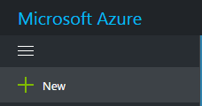
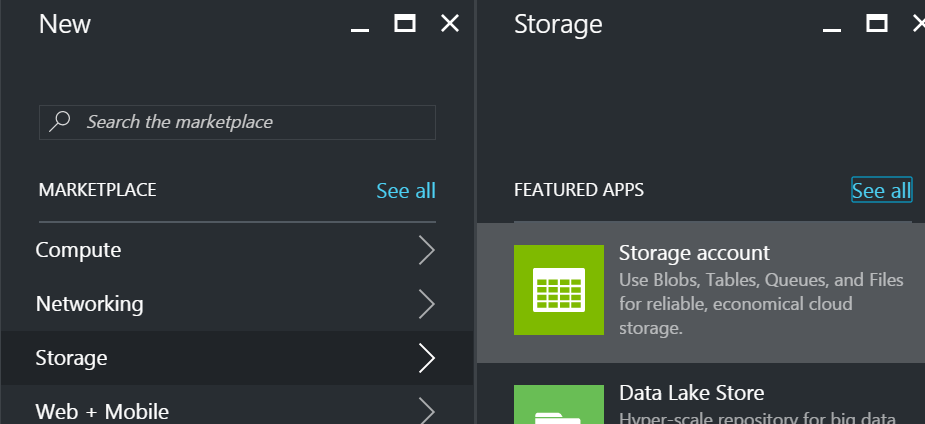
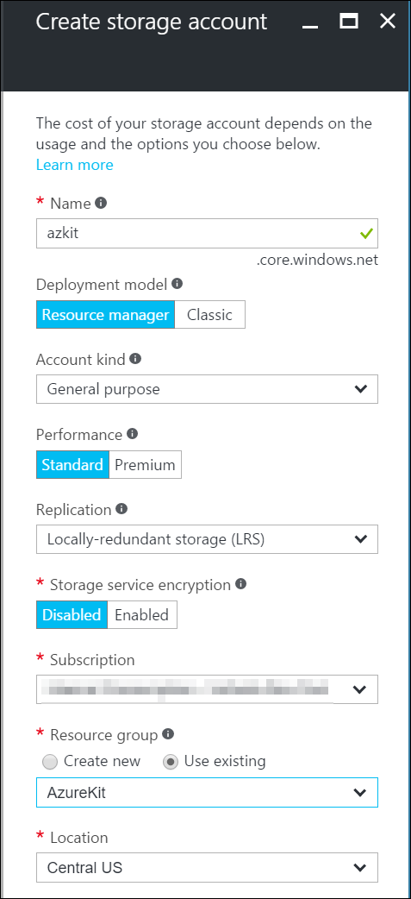

# Lab: Azure Storage

The Azure Kit stores media (images, video, etc.) as blobs in Azure Storage.
This is a cost-effective way of storing large quantities of data - storing
a terabyte of data with global redundancy costs only a few tens of dollars
per month, and you can store hundreds of terabytes in a single Azure Storage
account. Other storage systems such as SQL Server or DocumentDB are significantly
more expensive for very large volumes of data. That's because they offer
sophisticated functionality - Azure Blob Storage is cheaper because it's
very simple, but if all you want to do is serve chunks of binary data over
HTTP, it is ideal.

## Part 1: Creating a storage account

1.  In the Azure portal, click the **+ New** button at the top left

    

    Under **MARKETPLACE** select **Storage**, then under **FEATURED APPS**
    select **Storage account**

    

2.  In the **Create storage account** blade that appears, you must supply a
    globally unique name. (Azure will tell you if you pick a name that someone
    else is already using.) Leave the **Deployment model** as **Resource manager**.
    (The **Classic** model is only used for backwards compatibility purposes - code
    that uses the old Azure management API that predates ARM can only see Classic
    storage accounts.)

    Leave the **Performance** as **Standard**. Premium storage is only of use for
    storage the disk drives for virtual machines - you cannot use it to serve
    images over HTTP.

    If you have multiple subscriptions, select the one you are using. And
    set **Resource group** to the group you have been using so far in these labs.
    Pick the same location you've been using for everything else.

    

    Click **Create**.

3.  Once Azure has finished creating the account, go to its blade. (You can access
    the new account by clicking on **Microsoft Azure** at the top right to show your
    dashboard, then clicking on the tile for your Resource Group, which will show
    all the resources you have created for this lab.)

4.  Under **SETTINGS** click **Access keys**. This shows two pieces of information
    you will need to note down because you will be using them in the next stage.
    The first is the storage account name. (You already knew this, because it's the
    name you chose when creating an account, but if you haven't already done so, note
    it down.) And the second is an access key. There are two, but just note down the
    first one.

    (The reason there are two access keys is to enable you to replace keys without
    disrupting service. It is good practice to plan to change your keys on a regular
    basis, so that in the event of the key falling into the wrong hands, there will be
    a finite window of opportunity for data being compromised. The frequency with
    which you perform such updates will depend on the sensitivity of the data. The
    idea is that if your systems are currently using key1, when the time comes to
    change keys you would generate a new key2, and then switch everything over to that.
    key1 will continue to work, so there will be no disruption. Once every system has
    moved over to the new key, you can regenerate key1, meaning that the old value
    will no longer work.)

## Part 2: Enable Public Access and CORS

By default, an Azure Storage blob container will not permit access to its contents.
You must explicitly configure a container to enable unauthenticated requests if
that's what you want (and it is what we want). This alone is not sufficient to
enable direct access from scripts - we also need to enable CORS.

1.  In the blade for your Azure Storage account, show the **Overview** panel (which
    you will find as the first entry in the list on the left of the blade).

    Under **Services** click on **Blobs**

2.  In the **Blob service** blade, click the **+ Container** button at the top.

3.  In the **New container** blade, type **images** as the **Name**. Set the
    **Access type** to **Container**.

    Click **Create**.

4.  Close the **Blob service** blade, to return to the Azure Storage blade. In
    the list on the left of the blade, under **BLOB SERVICE** select **CORS**.

    Click the **+ Add** button at the top of the blade.

5.  In the **Add CORS rule** blade, set the following:
     * **Allowed origins** to `*`
     * In **Allowed verbs** check **DELETE**, **GET**, **POST**, and **PUT**
     * **Allowed header** to `*`
     * **Exposed headers** to `*`
     * **Maximum age (seconds)** to **1200**
    
    Click **Add**.

## Part 3: Configuring the Azure Kit Web Apps to Use the Storage account

1.  In the Azure portal, find your main Azure Kit web site. Under **SETTINGS**
    select **Application settings**.

    In the **App settings** section add a **azureStorageAccountName** property,
    and set the value to the name of your Azure Storage account. Also, add a
    **azureStorageAccountKey** property, and set it to the key you copied down
    for your Azure Storage account.

    Click **Save** at the top of the blade.

2.  Repeat the preceding step for your Azure Kit API app. And then repeat it again
    for your Azure Kit management site.

    You have now completed all the work for this lab. There's nothing you can do
    at this stage to validate your work because the site will not become functional
    until you complete the next lab.