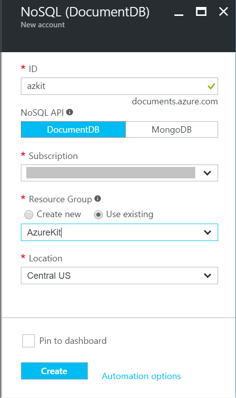
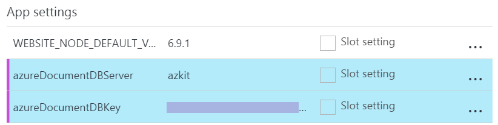

# Lab: DocumentDB

In this lab you will add the final component required for the Azure Kit to become
functional: a data store for the content. You will use Azure's DocumentDB, a
NoSQL database offering low latency, with the ability to scale out to provide consistent
performance even under very high load, and the option to replicate
data to multiple instances across the world, to provide this high performance in
all the regions you care about. You can also start small with a single region,
and moderate capacity, knowing that you'll be able to ramp up the performance when
your load increases.

## Part 1: Create a DocumentDB Instance in Azure

1.  Click the **+ New** button at the top left of the Azure portal.

    

    Select **Databases** then in the **FEATURED APPS** list, select
    **NoSQL (DocumentDB)**

    

2.  A blade will open asking you to supply details for the new DocumentDB
    instance. The **ID** field becomes part of the DNS name used to access
    the service, so this needs to be globally unique - Azure will tell you
    if you pick a name that someone else is already using.

    As always, if you have multiple Azure subscriptions you need to select
    the one you're using for these labs. Also, select the Resource Group
    you created for these labs.

    

    Click **Create**.

3.  If the blade for your new DocumentDB does not appear, just open up your
    Resource Group (click on its tile on your portal dashboard) and find it.
    Underneat the blade's **Essentials** section you should see a
    **Collections** section telling you that you don't yet have any collection:

    

    All DocumentDB data belongs to a collection, so you will need to create one.
    Tempting though it may be, do **not** click the **Get started** button - that
    will offer to create a collection called **Items**. The Azure Kit code will
    be looking for a different name, so we need to create the collection another way.
    Click the **+ Add Collection** button at the top of the blade.

    

4.  In the **Add Collection** blade that appears, set the **Collection Id** to
    **SiteContent**. Leave the **PRICING TIER** set to **Standard**

    For **PARTITIONING MODE** choose **Single Partition**. DocumentDB can split
    collections across multiple nodes to support high data and throughput
    volumes. We will start off with unpartitioned data because in this lab
    you're unlikely to enter more than 10GB of request data, so the higher
    cost of partitioning is unjustified. (When you create
    a real site, you will decide based on your capacity requirements whether
    you need partitioning. There are tools to migrate data in a single partition
    collection to a partitioned collection if you need to change this later.)

    For the **DATABASE** enter **azurekit**

    

    Click **OK**

    **Note:** If you want to try out partitioned mode, be aware that this can eat
    up your subscription's credits quite quickly, because the minimum service
    level is 10,100 request units per second, 25x higher than the minimum of
    400 available with a single partition. If you still want to go ahead, Azure
    will ask you to enter a **PARTITION KEY** of **/id**

5.  Azure selects a default reserved throughput of 1,000 RU/s. A Request Unit (RU)
    corresponds to a single request that returns a document of 1KB or less, so Azure
    is reserving enough capacity to handle 1,000 queries every second. You won't
    be using that much during the lab, so you should turn this down a bit to avoid
    consuming credit on your Azure account faster than necessary.

    On the main blade for your DocumentDB, under **COLLECTIONS** select **Scale**.
    This opens the **Scale** blade. At the top is a dropdown from which you can
    choose a collection to configure. (There will just be your **SiteContent**
    collection.) And beneath this you can configure how much reserved capacity
    you require. Use the **-** button to drop this to the minimum of 400,
    then click the **Save** button.

## Part 2: Use DocumentDB Collection from the Azure Kit

Now that you've created the **SiteContent** collection you can configure the three
sites in the Azure Kit to use it.

1.  You will need to supply the sites with an access key. To discover the value of
    this key, select the DocumentDB blade's **Keys** section (under **SETTINGS**).
    Copy the **PRIMARY KEY** and keep a note of it.

2.  Open the blade for your main Azure Kit web site. (You can find this by clicking
    the **Microsoft Azure** text at the top left to show the dashboard, then clicking
    the tile for your resource group, which will show everything you've created so far.)

3.  Under **SETTINGS** select **Application settings**. Scroll down to the
    **App settings** section in the setting blade.

    Add an **azureDocumentDBServer** setting, with the value set to the name you
    chose when creating your DocumentDB instance. (This is not the full DNS name of
    your DocumentDB instance, just the name you entered.)

    Add an **azureDocumentDBKey** setting, using the key value you discovered earlier.

    

    Click **Save** at the top of the blade.

4.  Repeat the preceding step for your Azure Kit API site, and then once again for
    Azure Kit Management site.

5.  In a web browser, go to your Azure Kit management site. If you haven't already
    signed in, do so now. Click on the Manage Simple Content link. This takes
    you to the **Simple Pages** page. Click the **Create New** link. This takes you
    to a form for adding a new page to the site.

    For the **Id** enter **test**. (This will form part of the URL of the page.)

    For the **Title** enter **Test Page**.

    For the **Content** enter **Test content.**

    Check the **Available on mobile** checkbox.

    Click **Create**.

    This should show a confirmation page. This has now added the page to the
    DocumentDB.

    Click the **Back to management home** link.

    Click the **Manage Simple Pages** link again.

    Click the **Add to SiteMap** link for your new page. This will make it appear
    on the banner that appears across the top of all pages.

6.  In a web browser go to your main Azure Kit site. If you already had it loaded,
    refresh the page. You should see a **Test Page** link at the top of the page, after
    **Azure Kit** and before **About**. Click it. You should see the **Test content.**
    text that you entered. This verifies that the data is in the DocumentDB
    where the main site can access it.