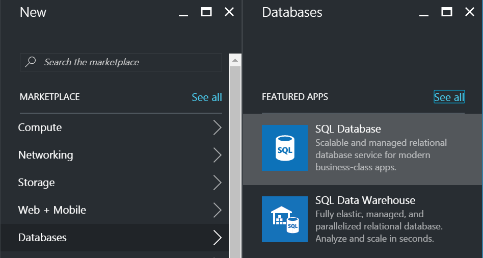
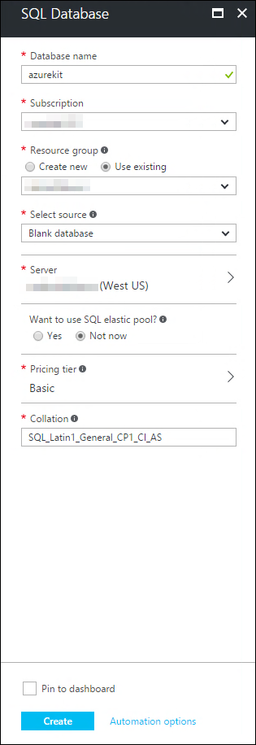
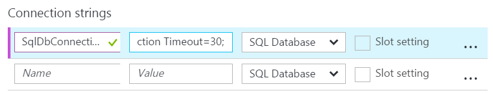
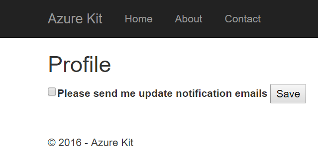
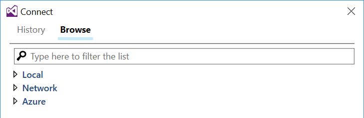
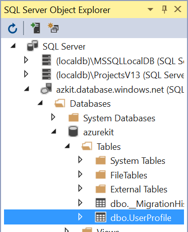

# Lab: SQL Server

In this lab we will see how to use an Azure SQL database. We'll be using it
to keep track of an end user's preferences for notification emails.

## Part 1: Create SQL Database in Azure

1.  In the Azure portal, click the **+ New** button at the top left. In the
    **MARKETPLACE** list that opens, select **Databases**, then from the
    **FEATURED APPS** list, choose **SQL Database**.

    

2.  In the **SQL Database** blade that opens, enter **azurekit** as the name
    of the database. (This name does not need to be globally unique - it is
    scoped to a SQL Server that you will create shortly).

    If you have access to multiple subscriptions, select the one you're using.
    Select the **Resource group** that you've been using for these labs.

    In **Select source** choose **Blank database**.

    Click **Server**. In the **Server** blade, select **Create a new server**.
    In the **New server** blade, enter a name for the server. (This will need to
    be globally unique, and as ever Azure will tell you if you try to use a name
    that is already in use). For the **Server admin login** type **sqladmin**.
    For the **Password**, make up a suitably secure password, and make a note of
    it. (Azure won't tell you later what password you chose.) Chose the same location
    as your Web Apps. Ensure that under **Create V12 server (latest update)** you
    select **Yes**. Ensure that **Allow azure services to access server** - without
    that your Web Apps won't be able to reach the server. Click **Select**.

    The blades for selecting and creating a new server will close, leaving you
    back at the **SQL Database** blade. Ensure that under **Want to use SQL
    elastic pool** you select **Not now**. For this lab, you can set the
    **Pricing Tier** to the cheapest option, **Basic**. (You might need to click
    **View all** in the **Choose your pricing** blade to see this option.)

    Leave the **Collation** on its default.

    

    Click **Create**. Wait for the SQL Database to be created. This can take a
    few minutes.

3.  Once Azure has created the database, open the SQL Server's blade. (You can find
    it in your Resource Group as usual.) Be sure to select the SQL Server resource,
    and not the SQL Database resource at this point.

    In order to be able to access the SQL Database from your computer, you will
    need to add a rule to the firewall - right now, only computers in Azure
    datacenters will be able to reach it. Click on  the **Show firewall settings**
    link in the **Essentials** section near the top of the blade.

    In the **Firewall settings** blade that opens, click the **+ Add client IP**
    button at the top. This will add a rule granting your IP address access to the
    server. (Note that if you use an internet service provider that changes your
    IP address on a regular basis, you will have to update these settings from time
    to time. There are other more permanent solutions, such as setting up a VPN in
    Azure, or creating a Virtual Machine from which to access the server, but those
    are beyond the scope of this lab.)

    Click **Save**.

4.  In the SQL Server blade, there will be a list of all the databases in your server -
    just the **azurekit** one right now. Click on this, and it will open the blade for
    that particular database. (You can also get to this same blade by clicking on the
    SQL Database entry in your Resource Group.)

    Near the top, in the **Essentials** section, click the **Show database connection
    strings** link. The **Database connection strings** blade that opens should be
    showing the **ADO.NET** tab, but if not, select that.

    Copy the connection string it shows and paste it into the text editor you're using
    to note down settings. You will need to make a couple of modifications - this
    connection string is not complete. You'll find it contains a placeholder:
    **{your_username}**. Replace this with **sqladmin**. (Replace the whole
    placeholder, including the {}.) There is also a **{your_password}** placeholder.
    Replace that with the password you chose when creating the SQL Server.

## Part 2: Configure the Azure Kit to Use the Database

1.  Open the blade for your main Azure Kit site in the Azure portal. In the list on
    the left, under **SETTINGS** select the **Application settings** entry.

2.  Scroll the main area of the blade down to the **Connection strings** section.
    (**Note:** this is not the same place you've added settings to in earlier labs.)
    Add an entry named **SqlDbConnection**. Paste in the connection string (with the
    username and password replacing the placeholders) as the value. Ensure that the
    third column shows **SQL Database** as the type.

    

    Click the **Save** button at the top.

3.  To test this, go to your main site in a web browser. If you are not already signed
    into the site, click the **Sign in** link at the top right and sign in with your
    Microsoft Account.

    There is a user profile page in this site for managing mailing list settings.
    There's currently no link to it in the navigation bar, so you'll have to add
    **UserProfile** to the end of the URL in the address bar. You might find this
    page takes a long time to load the first time you use it. This is because the
    site will automatically create a suitable schema in the database on first use.
    Once it loads, you should see this:

    

4.  The profile handling code adds per-user records on demand, so it will have added
    a new entry for you as a result of your visiting this profile page. Let's take
    a look at the data. In Visual Studio, open the **SQL Server Object Explorer**,
    which you can get to from the **View** menu. In this panel's toolbar, click the
    button to add a SQL Server to the view:

    

    In the **Connect** dialog that opens, chose the **Browse** tab, and expand
    the **Azure** entry
    
    

    You should see your **azurekit** database in the list (the the name of the
    server next to it). Select that. In the **Password** field lower down in the
    dialog, enter the password you chose for your SQL Server, then click **Connect**.

5.  Your Azure SQL Server should appear in the **SQL Server Object Explorer** panel.
    Expand its node, and inside that expand the **Databases** node, then the
    **azurekit** node, then the **Tables** node to find the **dbo.UserProfile** node:

    

    Right click on this, and select **View Data**. You should see a table with a single
    row, showing the email address you logged in with as the **ContactEmail** and
    the value **False** in the **NotificationEmailsEnabled** column.

6.  Back in the web browser, check the **Please send me update notification emails**
    checkbox, then click **Save**. In Visual Studio, refresh the view of the
    **UserProfile** table, and verify that the **NotificationEmailsEnabled** column
    now contains the value **True**.