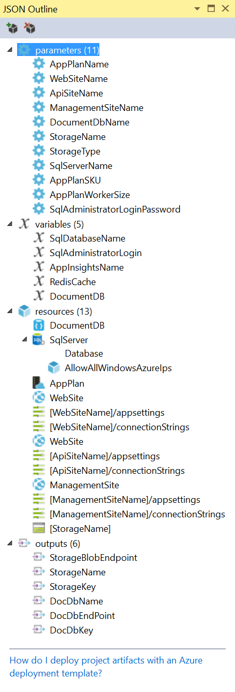
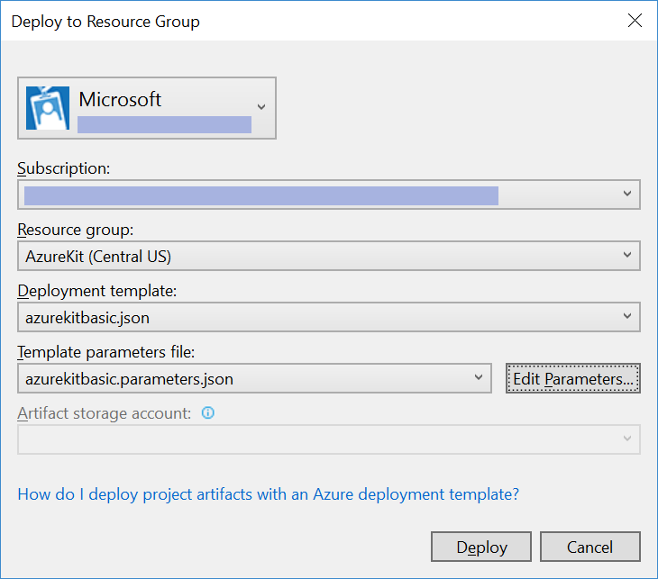
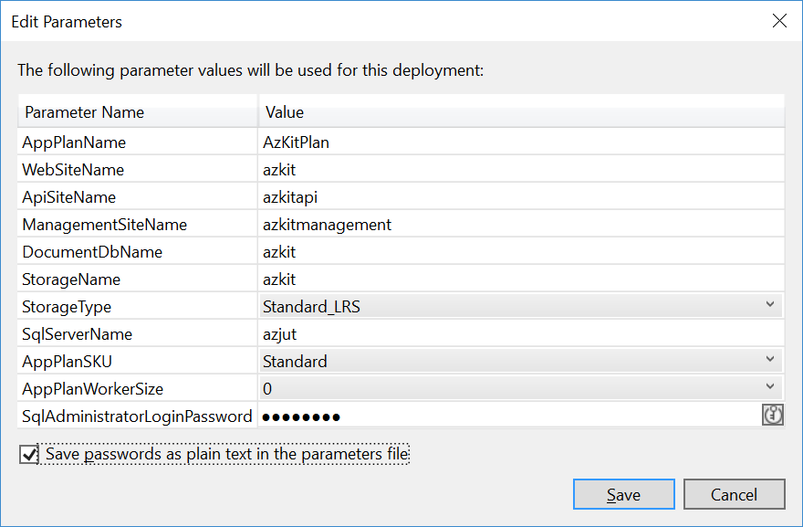
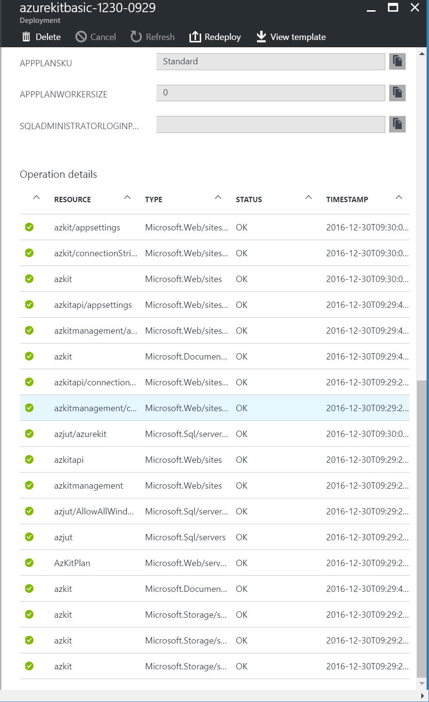
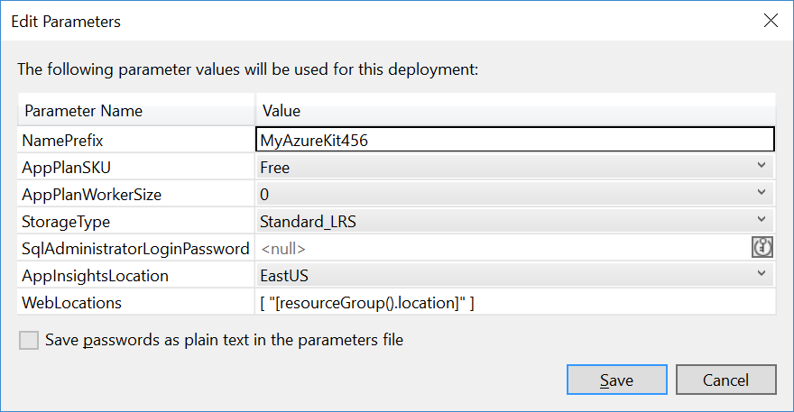

# Azure Resource Manager (ARM)

The creation, configuration and removal of resources in Azure is handled by a
system called Azure Resource Manager, usually abbreviated to ARM. You have been
using ARM indirectly through the Azure Portal - it is, in essence, a user interface
on top of the ARM API.

(Be aware that when Azure was first introduced, ARM had not yet been invented,
and there is an older system for managing resources known, for historical
reasons, as RDFE - Red Dog Front End, a title based on an old codename for Azure.
You will also sometimes see this referred to as *Azure Service Management*.
This legacy management system is still supported. Resources created through RDFE
are visible through ARM, and but there are some cases where this will limit the
available functionality. For example, as you saw in the Azure Storage lab, you
can choose to create a *classic* storage account. This will make the account
visible through RDFE, but will put certain newer Azure Storage functionality
off limits. The only reason for creating *classic* resources when you have the
option is if you have legacy code using RDFE that needs access to the resources.
You can access classic resource through ARM, but they often need to be handled
as a special case. For example, if you want to enumerate all storage accounts in an
Azure subscription, you'll need to ask ARM to provide you with two lists, because
it treats classic storage accounts as a distinct type of resource than ARM-style ones.
You should use Azure Resource Manager in any new code.)

There are other ways to work with ARM. You can install
[Azure commands for Powershell](https://docs.microsoft.com/en-us/powershell/azureps-cmdlets-docs/),
for example. (These support the legacy RDFE API too. The ARM-based commands all have
`Rm` in their names, and you should prefer these.) There is also a set of cross-platform
Azure command line tools known as the
[Azure CLI](https://docs.microsoft.com/en-us/azure/xplat-cli-install), which can
use ARM on Windows, Linux, or Mac OS. There's also an online resource browser - if
you go to [https://resources.azure.com/](https://resources.azure.com/) you can
explore all of the resources you have created - it will show you the JSON documents
that the ARM API returns to describe the resources you have created in Azure.

One of the most important features of ARM is that it enables automatic deployment
of sets of resources. You can create a *template* describing all of the resources
that you need to provide some service. This makes it easy to ensure that your
production, test, and development environments are all set up in exactly the same
way - instead of having to manually create all of the resources as you have done
so far in these labs, you can use a single template to create all of your
environments. You can incorporate this template into an automated release pipeline
to guarantee that your production environment is never out of sync with your
requirements.

ARM supports multiple redeployments to a Resource Group. This can operate in two
modes. There is an incremental mode, in which any resources you specify in a template
are added to existing ones. And there is a mode in which Azure will ensure that the
Resource Group exactly matches the template, deleting any existing resources not
mentioned in the template. If you use the latter as part of an automated release
system, ARM will only modify your Resource Group if anything changes - it inspects
the template and compares it with what is already deployed, and will only make changes
if it detects differences.

# Part 1: A Template for your Existing Azure Kit Resources

In this section, you will use a template to deploy the exact set of resources that
you have already created. This won't change anything, but it will make it possible
to move to a repeatable automated release pipeline, and will also open the door to
having multiple instances of the Azure Kit for production, staging, testing,
development, and so on.

1.  Azure can generate a template for you based on an existing resource group. This
    doesn't always produce the most flexible of results, so you may need to do some
    tweaking to produce a template that works for the environments you want, but
    it can be a very useful start.

    In the Azure portal, go to the blade for your Resource Group. In the list of
    icons and labels on the left, under **SETTINGS** click **Automation Script**.
    After a few seconds, this will produce a JSON file that will create a set of
    resources similar to the ones you have created by hand.

2.  Notice that Azure has detected a problem - you will see an orange banner indicating
    that it cannot export resources of type `Microsoft.Web/sites/config`. What this
    means is that the template it generates will not include any of the Application
    Settings or Connection Strings for any of your Web Apps. And there's a good
    reason for this: these kinds of settings are often based on other resources.
    
    For example, your settings include a key for your Azure Storage account. It would
    not be useful for Azure to copy that key directly into the template. What you need
    is for the template to create the Azure Storage account, and then automatically
    copy the key for that particular account into the Web App settings. It is possible
    for an ARM template to do this, but it is not possible for the Azure Portal to
    determine the relationships between resources and settings automatically. For
    this reason, it does not even attempt to include application settings in the
    ARM template that it generates.

3.  We have supplied a template for you that does handle configuration correctly.
    In Visual Studio, find the **AzureKit.Deployment** project. Expand it, and
    then expand its **Templates** folder. Open the **AzureKitBasic.json** file. This
    is an ARM template that creates the same resources that you have created in the
    preceding labs. Deploying this template will therefore change absolutely nothing
    in your Azure Resource Group, at which point you might wonder: what's the point?
    But by moving to template-based deployment, you can then take this template and
    use it to create new environments which you can be confident will have the same
    structure as your existing one.

    You can see the structure of file in the JSON Outline panel that appears when
    you open the template. (If you don't see this, you can open it using the
    **View | Other Windows** menu item.)

    

    If you look at the **resources** section, you can see all the elements you have
    previously created in the Azure Portal - the DocumentDB instance, the SQL
    Server and Database, the Azure App Service App Plan, the various web sites.
    And unlike the JSON generated by the Azure Portal, this also handles the
    Web App settings and connection strings. If you take a look at the first of
    these, you can see how this extracts the correct value for the DocumentDB
    key for your particular DocumentDB instance:

    `"azureDocumentDBKey": "[listKeys(resourceId('Microsoft.DocumentDB/databaseAccounts', variables('DocumentDB').Name), '2015-04-08').primaryMasterKey]",`

    This avoids hard-coding a key, so it will work correctly whatever environment you
    are deploying to, even though each environment will have a different key.

4.  To deploy this template, right click on the **AzureKit.Deployment** project in
    Solution Explorer, and select **Deploy | New Deployment**. This dialog opens:

    

    You should check that the right Azure Subscription and Resource Group are selected.
    Set the **Deployment template** to **azurekitbasic.json**, and the
    **Template parameters file** to **azurekitbasic.parameters.json**.

    This template needs the names of all your existing resources to work. (And for
    a new environment you'd need to supply it with the names you want to use for each
    resource in that new environment.) So click the **Edit Parameters** button,
    which shows this dialog:

    

    Fill in all of the values with the names of your resources. (These will be
    different than the values shown because these resources all have globally unique
    names.) Click **Save**.

    Back in the **Deploy to Reource Group** dialog, click **Deploy**.

5.  Visual Studio's **Output** panel will show progress. Eventually it should report
    that deployment is complete.

6.  Go to the Azure Portal, and open the blade for your Resource Group. On the
    left under **SETTINGS** select **Deployments**. This lists all of the times ARM
    has updated the contents of this Resource Group. You can see from this that the
    Azure Portal has been using ARM for you - you will see entries for each resource
    that you added in previous labs. The most recent entry (at the top) will be
    labelled something like azurekitbasic-0231-1045, but with different numbers.
    (Those are a date and time.) This is the template-based deployment you just ran.
    If you click it, you'll see a set of entries all with a status of **OK**. This
    tells you that nothing changed. (You would see **Deleted** or **Created**
    entries if the template hadn't matched the existing resources.)

    

7.  One last thing to be aware of is that there are some aspects of Azure resources
    that cannot be controlled through ARM. For example, you cannot create new blob
    containers, or upload blobs into an Azure Storage account using ARM. ARM will
    create the account for you, but what goes in there is not its concern. Likewise,
    ARM will create a DocumentDB instance, but cannot create or configure a collection
    in it. So if you look in the **Scripts** folder of the deployment project, and
    inspect the **Deploy-AzureResourceGroup.ps1** file, you'll see towards the end
    that after running the ARM deployment, it then inspects the DocumentDB and
    Azure Storage account, and creates the necessary collection and container, and
    configures them appropriately. This script runs every time you deploy from
    Visual Studio, so new environments will be set up appropriately, but you
    would need to ensure this same script runs if you incorporate template deployment
    in an automated release pipeline.

# Part 2: A Heavy-Duty ARM Template

In this section, you will inspect an ARM template supplied as part of the Azure Kit,
which can create resources suitable for a global web site with demanding scalability
and performance requirements. This template is able to create multiple instances of
the customer-facing Web Apps (the main site and the API) and their supporting
resources, each in a different region. This makes it possible to have instances of
the web site located in all the geographic regions in which you have customers,
along with supporting Redis Cache instances, and geo-replicated copies of the
DocumentDB database, meaning that all of your customers should be able to get
page response times measured in a handful of milliseconds. (This is not possible if
you have just one web server, because a customer in, say, London, will experience
delays of over a tenth of a second communicating with a web server on the West coast
of the USA. This is unavoidable because the speed of light means communication can
never occur faster across that kind of distance.) It sets up Azure Traffic Manager
to ensure that even though your web site appears to be a single entity with one
address, each end user will automatically be served by whichever server is nearest
to them.

This template creates the full set of resources from all of the labs. Consequently
it takes quite some time to deploy. And if you exploit its ability to deploy to
multiple regions, it is also somewhat expensive to leave running. So we don't
expect you to use this template for the labs - we supply it just so that you have
a working example of a complex Azure environment.

1.  In Visual Studio, expand the **AzureKit.Deployment** project, and expand its
    **Templates** folder. Open the AzureKit.json file. This is the ARM template
    that deploys a heavily-engineered version of the Azure Kit. Inspect the file.

2.  If you want to run the deployment you can, but be aware that it will create a lot
    of resources, so it will be slow, and will cause your Azure subscription to
    consume credit (or run up costs, if it's a pay-as-you-go account) quite quickly.

    This template works slightly differently than the previous one - it does not presume
    the existence of any resource before hand. So it assumes that it can take more control
    over the names. When you edit the parameters for this template, you'll see that it
    doesn't ask for lots of names, it just wants one **NamePrefix**

    

    It will use this as the basis for auto-genenerated names.

    By default, this template will deploy to just one region. If you want to
    see the multi-region deployment in action, you need to supply an array of
    values for the **WebLocations** parameter. For example, you could set this
    to `["westus","northeeurope"]. If you do this, you should set the **AppPlanSKU**
    to **Standard** because Azure Traffic Manager is not supported on the cheaper
    plan tiers.

3.  If you ran a deployment and want to try it out, be aware that this template does
    not deploy any code to any of the web sites - you'd need to publish to all the
    site instances yourself. This is left as an (extensive) exercise for the reader.
    Also, you will need to set up Azure AD - you cannot configure Azure AD from ARM.
    This becomes more complex once Traffic Manager is in the picture, because you can
    no longer rely on Azure Web Apps' ability to provide working HTTPS support out of
    the box. Traffic Manager requires you to bring your own certificate. So to be able
    to log into the public-facing web site you'd need to register your own domain name,
    obtain a certificate for that, register it with Traffic Manager, and then configure
    Azure AD appropriately. This is left as an (extremely extensive) exercise for the
    reader. The management site is still deployed as a single instance in this template,
    so Visual Studio can still handle the AAD configuration of that for you when you
    publish.