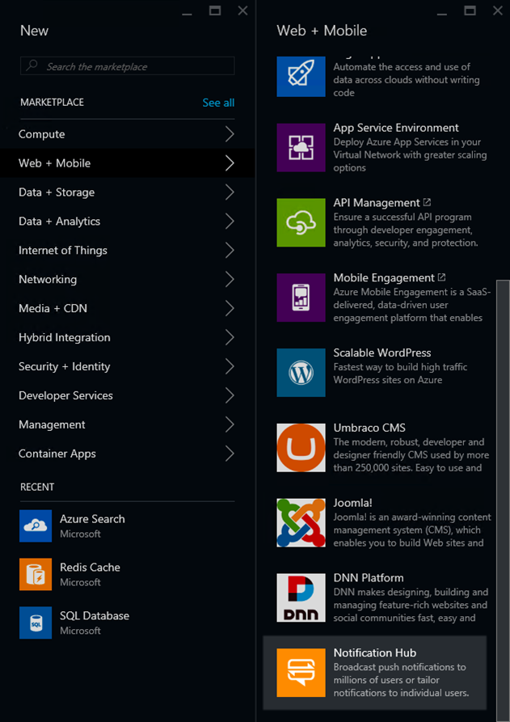

# Lab: Notification Hubs

## Part 1: Register the App

In this section, you will register your UWP application in the Windows store,
because the app must be registered to be able to receive notifications. (This is
true for all platforms - if you want to receive notifications on iOS or Android
devices, you'll need to register the relevant apps in those stores too. These
instructions only cover the Windows store.)

1.  In a new browser window or tab, go to 
    [https://dev.windows.com/](https://dev.windows.com/), and click the
    **Dashboard** link, logging in with your Microsoft account if you haven'to
    already done so.

2.  Click **Create a new app**.

    

3.  Type in a name for the app. This will need to be one that is not already taken.
    If you click Check availability, it will tell you if you chose one that is in use.
    Once you find one, click Reserve product name.

    

4.  11.	Once you are in the App overview screen, expand Services on the left and
    click Push notifications. A WNS/MPNS entry should appear under Push notifications.
    Click it.

    

5.  Click the link to the **Live Services site**.

    

     This takes you to the Registration page for your new app.

6.  Copy the **Package SID**  the **Windows Store** section, and keep a note of it
    in a text editor - you'll need it soon. (Don’t use the Application Id.)

7.  Also note down the **Application Secret**.

8.  Next, you need to associate your client app with the application you just created
    in the Dev Center so that it is able to receive notifications delivered to that
    app. In Visual Studio, open the **AzureKit - Mobile UWP Only.sln** solution,
    and then right-click on the **AzureKitMobile.UWP** project in Solution Explorer
    and select **Store | Associate App** with the Store.

9.  In the Wizard, click **Next**.

10. Sign in if required, and select the app you just created from the list.

    

11. Click Next, then click **Associate**.

## Part 2: Create Notification Namespace and Hub in Azure

1.  In the Azure portal, click **+ New** at the top left, select **Web + Mobile**,
    and find and select **Notification Hub** in the list that appears.

    

2.  In the **Notification Hub** field enter a name of **UpdateNotificationHub**.
    In **Create a new namespace** you will need to pick a globally unique name.
    Choose the same location, Resource Group, and Azure subscription as you have
    been using throughout these labs. Leave the **Pricing tier** set to **Free**.

    

    Click **Create**. Azure may take a few minutes to create the hub.

3.  Once the **UpdateNotificationHub** is ready, open its blade in the Azure portal.
    In the list on the left of the blade, under **MANAGE** select
    **Notification Services**. In the list of providers that appears, select
    **Windows (WNS)**.

    

4.  Copy the Package SID you noted down in the previous section to the
    **Package SID** field in the Windows (WNS) pane in the Azure portal.

5.  Copy the Application Secret you noted down in the previous section to the
    **Security Key** field in the Azure portal. Click the **Save** button at
    the top.

6.  Back in the list of items to the left of the notification hub's blade,
    under **MANAGE** select **Access policies**. This will list two policies.
    Copy the **CONNECTION STRING** for the one that offers **Listen, Manage, Send**
    permission. Note this down.

## Part 3: Configure the Web Apps

1.  Open the blade for your Azure Kit mobile API Web App. Under **SETTINGS** select
    **Application settings**. In the **App settings** section, add a property called
    **MS_NotificationHubName** and set it to **UpdateNotificationHub**. In the
    **Connection strings** section of the settings, add an entry called
    **MS_NotificationHubConnectionString**, set its value to the connection string
    you copied earlier, and set the dropdown to **Custom**. Click **Save**.

2.  Repeat the previous step but for the Azure Kit management Web App.

## Part 4: Raise Notifications

1.  In a web browser, navigate to the Azure Kit management site. On the home page,
    click the **Send notifications** link.

2.  Set the **Title** to **Test Message**, and the **Message** to **This is a test**.
    Click the **Create** button. You should see a notification pop up on the
    bottom right corner of your screen.
