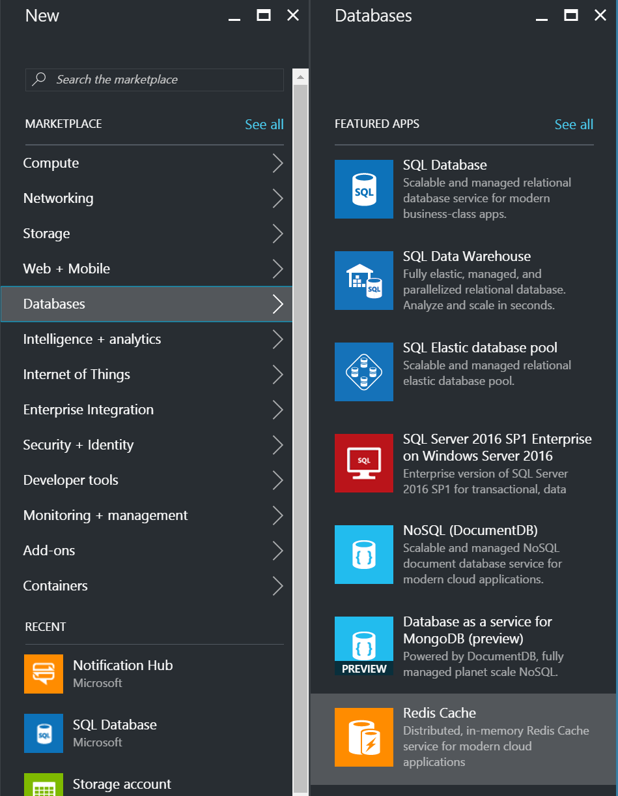
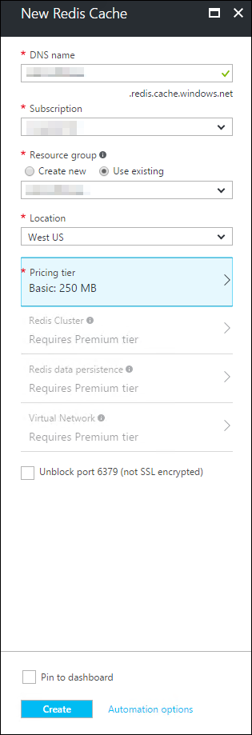
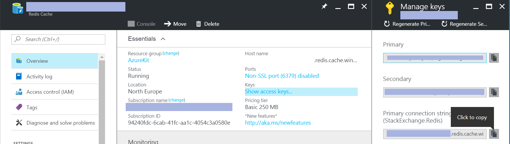

# Lab: Redis Cache

The Azure Kit uses ASP.NET output caching to improve the throughput that can
be achieved from a server farm, and to reduce the load on the DocumentDB. (While
DocumentDB scales well, it can be more cost effective to reduce the query rate
through output caching than to add more DocumentDB capacity.) The Azure Kit uses
the Redis Cache output caching provider to do this, enabling a single output cache
to be shared by all of the machines in a web farm.

Redis Cache is data store that holds information in memory, enabling very fast
response times. Redis Cache is an open source product, and you could host it on
a Virtual Machine, but Azure offers it as a service - you can create a Redis
Cache instance starting from 250MB of memory, with the portal offering
configurations with up to 53GB of memory (with even larger configurations
available if you call support). You can optionally configure replication to a
hot standby with automatic failover, and the Premium tier offers optional
clustering and data persistence.

You can use a Redis cache in various ways. It offers a key/value store, a publish/
subscribe mechanism, list- and set-based data storage, bitmaps, and geospatial
indexes to name just a few of its features. In the Azure Kit we use it
indirectly through an ASP.NET output cache provider supplied by Microsoft.


## Part 1: Create Redis Cache in Azure

1.  Click the **+ New** button at the top left of the Azure portal. Under
    **MARKETPLACE** select **Databases** then in the **FEATURE APPS** list
    select **Redis Cache**.

    

1.  Choose a **DNS Name** which must be globally unique. 

1.  Select the Azure subscription, Resource Group, and region that you've 
    been using so far in these labs.

1.	Click on **Pricing Tier** and select **Basic**.

    

1.  Click **Create**.
    > **Note:** this can take quite some time 15 to 30 minutes (or more). You can move on to the next step while Azure does
    this.

1.  While you are waiting for Azure to create your Redis cache, take a look
    at the code and configuration that takes advantage of output caching. In
    Visual Studio, look in the **AzureKit** project's **Controllers** folder,
    and open the **ContentController.cs** file. Find the **Index** method.
    Notice that there is an attribute before the method:

    `[OutputCache(CacheProfile = Config.Constants.CACHE_DEFAULT_PROFILE)]`

    This tells ASP.NET that we want to cache the output of this controller, and
    that it should use the output caching profile named by that string constant,
    which happens to have the value `DefaultContentProfile`.

1.	Open the **AzureKit** project's **Web.config** file.

1.	In the **Web.config**, find the `<caching>` section. 
	
	Inside this you will find an `<outputCacheSettings>`
    element which contains an `<outputCacheProfiles>` section with a single
    profile named `DefaultContentProfile`. This sets the caching duration to
    60 seconds (1 minute), and its `varyByParam='*'` setting indicates that
    controllers using this cache profile may generate different output if any
    input parameter changes. (In our case, the action using this cache profile
    has a single parameter, `id` which selects the content to show, meaning that
    each `id` will produce different output.)

    A little further on in the **Web.config** file you will find an
    `<outputCache>` element specifying that the Redis Cache output
    provider is the default (and, for our app, only) provider to use.

	Before you connect ReDis Cache to your app, you'll want to make a quick change to your main web site.

1.	In Visual Studio, open **Index.cshtml** under **Views | Home** in the **AzureKit** project.

1.	Around line **20** under the *Getting Started* **H2** element, add the following bit of markup:

    ```
		<p>Cache Test: @(DateTime.Now)</p>
    ```

1.	Save your changes and deploy just this project (via Project's **Publish** command).

1.	Once the deployment is done, access the home page and not the current date & time. Refresh the page a notice how the seconds update immediately.

1.	Now, once Azure has finished creating your Redis Cache, open its blade. (As always,
    you can get to this through your Resource Group, the blade for which is
    accessible through a tile on your Azure portal dashboard.)

1.	You need to find the connection string, which you can find by clicking the **Show access keys** 
    link in the **Essentials** section near the top of the blade.

   	

   	> Note down a copy of the **Primary connection string**

## Part 2: Configure your Web App

1.  Open the blade for your main Azure Kit Web App in the Azure portal.
 
1.	In the list on the left, under **SETTINGS** select **Application settings**. 

1.	In the **App settings** section, add a new setting called **redisCacheConnection**.
    Set its value to the connection string you obtained in the preceding section.

1.	Click **Save** to persist your changes.

1.	Now access your home page and refresh the page. Make note of the time.

1.	Refresh the page again and again, and notice the value stays the same. 
	
1.	Wait for about **60** seconds and refresh. You should see a new value.