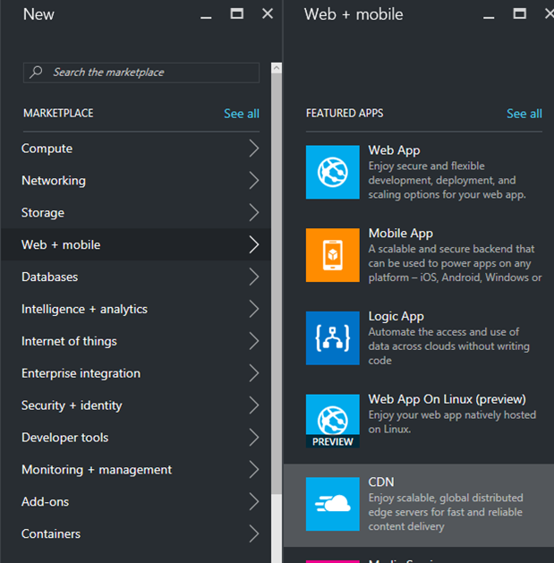
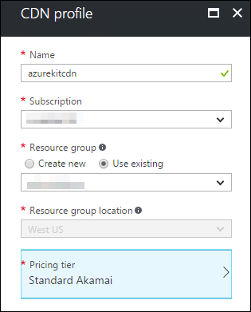
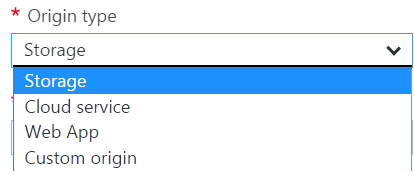
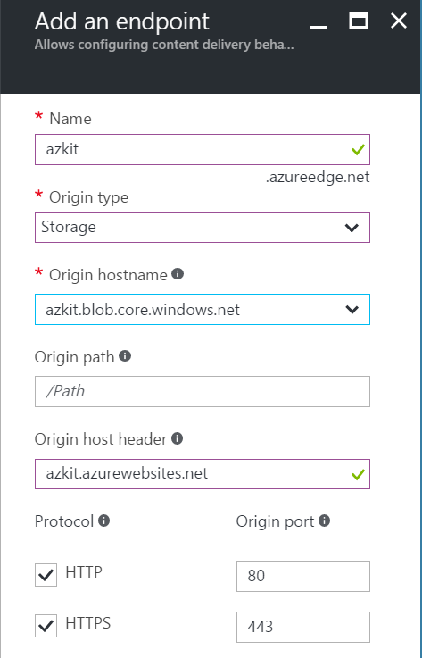

# Lab: Content Delivery Network (CDN)

Content Delivery Networks (CDNs) are a widely used way to improve the performance
and scalability of a web site. With a CDN, you arrange for your site's static
content be served by web servers in the CDN instead of your servers. This can be
particularly effective for large files such as images and video.

CDNs have large numbers of servers distributed throughout the world. They arrange
for end users to get their content from whichever server is nearest. This is how a
CDN can improve performance - if a user is in London, web requests to a London-based
CDN server will complete more quickly than they could to a web server elsewhere in
the world. (You can achieve something similar in Azure without a CDN by creating
multiple instances of your web app across the globe, and using Azure Traffic Manager
to direct requests to the nearest one. But a CDN can be a more cost-effective way
of obtaining most of the same benefits. If you use a CDN, dynamic content must still
come from your web servers, but with some sites, the majority of the content can
come from the CDN.)

Even if you don't have such global needs, a CDN can still be useful for scalability
and cost reasons because it can reduce the bandwidth demands on your servers. Firstly,
by getting the CDN's servers to do work that would otherwise be done by your servers,
you will be able to server more users with a particular App Service plan. Furthermore,
in Azure you are charged for the quantity of data downloaded from your servers, and
with large assets this can become a significant cost, so a CDN might be a more cost
effective approach.

## Part 1: Create CDN in Azure

In this section, you will configure a CDN to serve content from the Azure Storage
account blob container you created in an earlier lab. (This is where the Azure Kit
stores all user-supplied images and video.)

1.  In the Azure portal, click **+ New**, select **Web + Mobile** and, in the list
    that appears, find and select CDN.

    

2.  Set the **Name** to **AzureKitCdn** (this name does not need to be globally
    unique - only unique within your Resource Group), choose the same Azure subscription
    and Resouce Group that you've been using throughout these labs. (You do not need
    to specify a region because a CDN is inherently global.)

    Set the **Pricing tier** to **S2 Standard Akamai**. The main reason we're using
    Akamai here is that it can set up new endpoints more quickly than the
    alternatives, which is useful when you're trying to complete a lab.

    

    Click **Create**.

3.  Once Azure has finished creating the profile, open the blade for it. As
    always, you can just click the relevant icon in your resource group.
    In the button bar near the top of the CDN profile blade, click the
    **+ Endpoint** button to add a new endpoint. (A single CDN profile can
    work with content from multiple web servers, and you set up one endpoint
    per server. We have only one web server, so we need just one endpoint.)

    

4.  Type in a name for the endpoint. This will need to be one that is not
    already taken. If you choose one that is in use, Azure will tell you by
    showing a red exclamation mark next to the name. You’ll need to pick a
    variation that makes it show a green tick.

    **Note:** you will need this name in the next part of the lab, so take a note
    of the name you chose.

    In the **Origin type** dropdown, select **Storage**. The Azure Kit stores all
    media gallery content in an Azure Storage blob container, so we need to point
    the CDN at that.

    

    The **Origin hostname** dropdown should now show a list of all the Azure Storage
    blob services in your subscription. Select one your create for the Azure Kit.

    

    Click **Add**. You can move on to the next part of the lab without waiting
    for Azure to finish.

Note that if you wanted to serve up CSS and script through a CDN, you would need
to configure a second CDN endpoint, because that content comes directly from the
Web App. A CDN endpoint can provide content from only a single origin, and the
one you just configured is pointing at an Azure Storage blob server.

## Part 2: Configure App to Use CDN

The Azure Kit main web site is able to make use of a CDN in its Media Gallery pages.
(A Media Gallery is a collection of images and/or videos.) The code in question detects
when no CDN has been configured and serves the images directly in that case, which is
how the site has been working so far. But if you supply it with the name of a CDN
endpoint, it will generate URLs for the media assets that point to the CDN instead.
So all you need to do to start using your new CDN endpoint is to add a configuration
setting to the main site's Web App.

1.  Open the blade for your main Azure Kit site in the Azure portal. Open the
    **Application settings**, and in the **App settings** section, add a property
    called **azureStorageCDN**. Set its value to **YOUR_ENDPOINT.azureedge.net**,
    substituting the name you chose for the endpoint in the previous section.
    Click **Save**.

2.  You'll now need to add some image content so that you can test. Open the Azure Kit
    management site in a browser. On the home page log in if requested, then select
    **Manage Media Gallery Page**. Click **Create New**. Enter **gallery1** as the
    **Id** (this forms part of the gallery's URL), and enter  whatever name and
    description you like.

3. Once you have created the gallery, go back to the management home page and select
    **Manage Media Gallery Page**, and this time you should see your new gallery.
    Click its **Edit** link.

    Click the **Add media** button. Click the **Choose file** button and find an image
    file. Enter a suitable title and description. Click **Upload**

    Go back to the home page one more time, and go to the **Manage Media Gallery Page**
    and this time, click the **Add to SiteMap** link to make the gallery appear on the
    banner along the top of the web page of the main site.

4.  You will now need to wait for Azure to finish creating the CDN endpoint, so go
    back to the Azure portal, and check to see if it is done. If not, wait for it
    before proceeding.

5.  Navigate to your main Azure Kit site in a web browser. You should see a link to
    your new gallery in the banner along the top of the page. Click it.

6.  You should see your image. Use the browser to work out where the image came from.
    (E.g., if you are using Chrome, you can right-click the image and select
    **Copy image address** to copy the image's URL to the clipboard.) You should find
    that the image is coming from a server whose name starts with your CDN endpoint
    name, and which ends in `azureedge.net`.

    Click on the image thumbnail in the gallery to show the whole image. The image's
    address will now be in the web browser's address bar. Again, this URL should be
    using the CDN endpoint's hostname.

